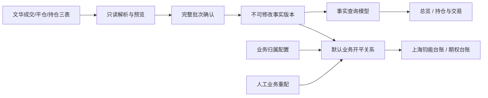

# 交易管理模块技术设计

版本：V1.0
日期：2026-07-12
状态：待用户书面审阅
业务基准：`/Users/wangjingze/Documents/交易台账自动化处理/docs/2026-07-12_交易管理模块开发业务需求说明.md` V1.1
页面原型：`/Users/wangjingze/Documents/交易台账自动化处理/personal_workbench/trading_static/`，提交 `c1de82b`

## 1. 设计结论

交易管理作为新的一级菜单接入现有轻量化交易管理系统，与旧“台账管理”并存。新模块使用独立的统一交易事实层、业务归属层和业务开平关系层，不迁移、不修改、不复用旧上海钧能业务表。

P0 交付五个二级页面：

1. 总览；
2. 持仓与交易；
3. 上海钧能台账；
4. 期权台账；
5. 汇总与导出。

其中“汇总与导出”仅交付空状态和后续扩展入口，不生成文件；资金利息、实时浮动盈亏和期权风险指标只保留字段与页面位置，统一显示“待计算”。

系统只读取、导入、核验、归类、计算和展示交易数据，不提供任何真实交易或资金操作。

## 2. 核心口径

### 2.1 单一事实、双展示口径

系统只保存一套不可修改的原始交易事实，但提供两类派生结果：

- 事实口径：文华成交、平仓、持仓及逐笔平仓盈亏的原始结果，用于总览、持仓与交易和账户核对；
- 业务口径：在事实价格和数量基础上，结合业务归属及可人工调整的业务开平关系计算，用于上海钧能台账、期权台账和后续策略分析。

人工业务重配只能改变业务开平关系、业务剩余持仓成本和各业务之间的盈亏分配，不能修改事实记录、事实配对或事实平仓盈亏。

### 2.2 业务字段

- 业务归属：独立受控字段，表示业务主体，例如“上海钧能”“期货组”；
- 业务类型：固定为“基础套保”“战略套保”；
- 策略：可搜索下拉并允许手动输入；初始值从新合并版模板完整提取；
- 交易指令信息：可选说明字段；
- 单笔成交必须整笔归类，不允许按部分手数拆分到不同业务。

### 2.3 事实盈亏与业务盈亏

- 事实平仓盈亏直接取平仓记录中的逐笔平仓盈亏；
- 业务归属盈亏按业务层选中的开仓事实价格、平仓事实价格、方向、匹配手数和合约乘数计算；
- 一笔平仓可关联一笔或多笔开仓；多笔开仓必须具有完全一致的业务归属、业务类型和策略；
- 同一平仓的业务匹配手数合计必须等于事实平仓手数；
- 合约全部平仓且业务关系完整后，同账户、合约、方向的业务盈亏合计必须与事实盈亏合计一致。

## 3. 系统结构

### 3.1 后端边界

新增独立模块：

- `backend/app/trading_management.py`：请求模型、三表解析、导入预览与确认、事实查询、业务归类、业务重配、业务持仓重算和页面接口；
- `backend/app/db.py`：只增加交易管理表结构、兼容迁移和必要索引；
- `backend/app/main.py`：只负责注册交易管理路由，不放置交易管理业务逻辑；
- `backend/app/permissions.py`：增加交易管理资源映射和模块权限映射。

不修改旧上海钧能接口的行为，不把新事实写入 `sh_junneng_trades`、`sh_junneng_positions` 或 `sh_junneng_close_trades`。

### 3.2 前端边界

新增：

- `frontend/trading_management.js`：交易管理状态、接口调用、筛选分页、导入预览、归类、人工重配和五个页面渲染；
- `frontend/trading_management.css`：只包含新模块样式。

修改：

- `frontend/index.html`：增加一级菜单、五个二级菜单、页面容器、导入/归类/重配对话框和新静态文件引用；
- `frontend/app.js`：只增加一级菜单路由、权限可见性和对 `window.TradingManagement` 的最小委托。

新页面保持已确认原型结构，不重设计旧模块。

### 3.3 数据流

## 4. 数据库设计

所有新表同时支持 SQLite 和 PostgreSQL。时间统一保存为可排序的 ISO 8601 文本；金额和价格继续遵循项目当前数据库数值类型约定。表名统一使用 `trading_` 前缀。

### 4.1 账户与导入批次

#### `trading_accounts`

- `id`；
- `account_code`：稳定唯一编码；
- `display_name`；
- `masked_name`；
- `is_active`；
- `created_at`、`updated_at`。

#### `trading_import_batches`

- `id`；
- `account_id`；
- `range_start`、`range_end`；
- `position_snapshot_date`；
- `status`：`preview`、`active`、`superseded`、`failed`；
- 三个源文件名、SHA-256 摘要、记录数和解析摘要；
- `supersedes_batch_id`；
- `created_by`、`confirmed_by`、`created_at`、`confirmed_at`。

同一账户允许多个不重叠的有效日期范围。新批次与旧批次日期范围完全相同时可以替代；部分重叠但范围不一致时预览必须阻止确认，要求用户上传覆盖范围明确的完整三表，避免静默丢失范围外事实。

#### `trading_source_rows`

- `id`、`batch_id`；
- `source_type`：`trade`、`close`、`position`；
- `source_file`、`source_sheet`、`source_row_no`；
- `raw_hash`；
- `raw_json`；
- `created_at`。

源行只追加，不更新、不删除。

### 4.2 稳定事实身份与版本

#### 三表解析映射

文华文件按已确认样本的分组格式解析：首行为字段名，第一列出现 `YYYYMMDD` 时切换当前数据日期，其余非空行属于该日期。

- 成交记录页签 `成交记录`：映射 `交易所`、`合约`、`买卖`、`开平`、`手数`、`成交价`、`成交额`、`平仓盈亏`、`手续费`、`投保`、`权利金收支`；
- 平仓记录页签 `平仓记录`：文华使用开仓说明行加平仓数据行的两行结构，映射 `开仓日期`、`交易所`、`合约`、`买入/卖出`、`手数`、`价格`、`逐笔平仓盈亏`、`手续费`、`权利金收支`；
- 持仓记录页签 `期末持仓`：映射 `交易所`、`开仓日期`、`合约`、`买卖`、`手数`、`价格`、`浮动盈亏`、`盯市盈亏`、`占用保证金`、`投保`。

字段名允许配置明确的等价别名，但预览必须展示实际识别结果；未知表头不得按列序猜测。

#### 稳定签名与继承

源文件没有可靠成交 ID 时，系统生成标准化事实签名：

- 成交签名：账户、交易日、成交时间（如有）、交易所、合约、买卖、原始开平、手数、成交价、成交额和手续费；
- 平仓签名：账户、开仓日期、平仓日期、交易所、合约、开仓方向、平仓方向、手数、开仓价、平仓价和逐笔平仓盈亏；
- 持仓签名：账户、快照日期、交易所、合约、方向、开仓日期、手数、持仓均价和保证金。

签名字段统一处理空白、大小写、日期、方向和数值精度后计算 SHA-256。完全相同的重复行组成一个签名组，并按源行顺序分配批次内实例序号。

跨批次继承只在以下情况自动执行：签名唯一；或新旧签名组数量一致且组内业务配置完全一致。相同签名组中存在不同业务配置时无法证明逐行身份，必须进入待核验，不能依赖源行序号强行继承。

#### `trading_fact_identities`

- `id`；
- `account_id`；
- `fact_type`：`trade`、`close`、`position`；
- `stable_key`；
- `created_at`。

唯一约束：`account_id + fact_type + stable_key`。

业务归类和人工开平关系引用稳定事实身份，而不是某次导入批次的物理行，从而支持重新导入后继承。

#### `trading_trade_facts`

- `id`、`identity_id`、`batch_id`、`source_row_id`；
- 账户、交易日、成交时间、交易所、合约、资产类型；
- 买卖方向、原始开平、标准开平；
- 手数、成交价、成交额、成交手续费、投保标志；
- 数据状态和核验状态。

#### `trading_close_facts`

- `id`、`identity_id`、`batch_id`、`source_row_id`；
- 开仓日期、平仓日期、交易所、合约；
- 开仓方向、平仓方向、手数、开仓价、平仓价；
- 逐笔平仓盈亏；
- 匹配手续费、手续费状态；
- 数据状态和核验状态。

#### `trading_position_snapshots`

- `id`、`identity_id`、`batch_id`、`source_row_id`；
- `snapshot_date`、`snapshot_time`；
- 交易所、合约、资产类型、方向；
- 手数、持仓均价、保证金；
- 估值价格、浮动盈亏、行情时间、估值状态；
- 数据状态和核验状态。

P0 的估值相关字段为空，估值状态为 `pending_calculation`。

#### `trading_contract_specs`

- `exchange`、`product_code`、`asset_type`；
- `contract_multiplier`、`price_tick`；
- `source`、`is_active`、`updated_at`。

唯一约束：`exchange + product_code + asset_type`。P0 使用经过样本核验的合约配置初始化所有 2026 年 6 月样本品种；缺少乘数时业务盈亏不得猜测，记录标记为“合约参数待核验”。

### 4.3 事实关联

#### `trading_fact_close_allocations`

保存系统根据文华数据得到的事实层开平关系：

- `close_identity_id`；
- `open_trade_identity_id`；
- `matched_quantity`；
- `match_rule_version`；
- `status`；
- `created_at`。

该表用于解释文华先开先平关系和事实核对，人工业务重配不得修改它。

#### `trading_close_trade_links`

保存平仓记录与成交表中平仓成交的匹配关系，用于将逐笔平仓盈亏和成交手续费映射到“全部交易”：

- `close_identity_id`；
- `close_trade_identity_id`；
- `matched_quantity`；
- `allocated_fee`；
- `status`、`rule_version`。

### 4.4 业务配置

#### `trading_business_subjects`

- `id`、`name`、`normalized_name`；
- `is_active`；
- `created_by`、`updated_by`、`created_at`、`updated_at`。

名称在标准化后唯一。停用不影响历史记录。

#### `trading_strategies`

- `id`、`name`、`normalized_name`；
- `is_active`；
- `merged_into_id`；
- `source`：`template`、`manual`、`admin`；
- 创建和修改审计字段。

策略合并只影响后续选项和规范显示，不改写历史操作日志。

#### `trading_business_assignments`

- `trade_identity_id`；
- `business_subject_id`；
- `business_type`：`basic_hedging` 或 `strategic_hedging`；
- `strategy_id`，可空；
- `instruction_text`，可空；
- `assigned_by`、`assigned_at`、`updated_by`、`updated_at`。

一条稳定成交身份最多一条当前业务归属，因此整笔成交不能拆分。

### 4.5 业务开平关系

#### `trading_business_close_allocations`

- `id`；
- `close_identity_id`；
- `open_trade_identity_id`；
- `matched_quantity`；
- `source`：`fact_default` 或 `manual_override`；
- `override_group_id`；
- `business_pnl`；
- `rule_version`；
- `created_by`、`created_at`、`updated_by`、`updated_at`。

同一平仓允许多条开仓分配记录。数据库事务和服务校验共同保证：

- 匹配账户、合约和持仓方向一致；
- 开仓时间不晚于平仓时间；
- 多笔目标开仓业务归属、业务类型和策略一致；
- 平仓分配合计等于事实平仓手数；
- 任一开仓累计业务已平手数不超过开仓手数。

人工重配保存时，平仓业务归属从目标开仓自动继承。旧分配在审计表中留痕，不保留两套同时生效的业务关系。

#### `trading_business_allocation_audit`

- `id`、`override_group_id`、`close_identity_id`；
- 调整前分配 JSON、调整后分配 JSON；
- 调整前业务盈亏、调整后业务盈亏；
- 操作原因、操作人、操作时间。

### 4.6 导入继承和核验

新批次确认时按稳定事实身份继承业务数据：

1. 新旧事实稳定键相同且数量、账户、合约、方向、开平等关键字段一致时，保留业务归属；
2. 人工开平关系引用的所有稳定身份在新有效批次中仍存在且数量约束仍成立时，保留人工关系；
3. 任一目标消失、数量减少、方向变化或关系不再唯一时，不继承人工关系，恢复可解释的默认事实关系并标记 `inheritance_review_required`；
4. 旧批次状态改为 `superseded`，原始源行和审计记录保留；
5. 上述切换在单一数据库事务中完成。

## 5. 计算设计

### 5.1 事实视图

- 总览和持仓与交易只查询状态为 `active` 的批次事实；
- 当前持仓以最新有效持仓快照为权威数量、持仓均价和保证金来源；
- 事实平仓盈亏只取 `trading_close_facts`；
- 全部交易中的平仓盈亏通过 `trading_close_trade_links` 映射，未匹配时显示“待核验”；
- P0 浮动盈亏和希腊字母统一返回 `null + pending_calculation`，前端显示“待计算”。

### 5.2 默认业务关系

完成导入后：

1. 平仓记录与成交表平仓成交先按账户、平仓日期、合约、平仓方向和成交价分组匹配；组内总手数一致时，按手数比例映射逐笔平仓盈亏和成交手续费，不一致时标记待核验；
2. 平仓记录再按账户、合约、开仓方向、开仓日期和开仓价匹配开仓成交；同组存在多笔时按成交时间和源行顺序进行事实层先开先平数量分配；
3. 根据上述事实开平关系生成 `fact_default` 业务分配；
4. 开仓成交完成业务归类后，对应默认平仓继承该开仓的业务归属；
5. 无法形成完整业务关系的平仓进入待归类或待核验；
6. 业务当前持仓由完整开仓成交减去业务分配手数得到；
7. 业务持仓必须与事实快照进行数量核验，差异显示在核验结果中，不得伪装一致。

### 5.3 人工业务重配

人工重配采用“预览影响—确认保存”两步：

1. 用户在上海钧能或期权台账选择一笔平仓；
2. 系统只列出同账户、同合约、同持仓方向、开仓时间合规且仍有业务可平手数的开仓；
3. 用户选择一笔或多笔同业务配置开仓；
4. 预览返回旧分配、新分配、恢复未平手数、扣减未平手数、调整前后业务盈亏和受影响汇总；
5. 用户确认后在一个事务内替换当前业务分配、自动继承目标业务配置、写审计并重算；
6. 并发修改通过分配版本号校验；版本不一致返回冲突，要求刷新后重新预览。

### 5.4 业务盈亏

期货业务盈亏：

- 多头：`(平仓价 - 业务开仓价) × 匹配手数 × 合约乘数`；
- 空头：`(业务开仓价 - 平仓价) × 匹配手数 × 合约乘数`。

期权使用期权合约自身成交价格和对应乘数，方向公式与期货一致。业务手续费单独展示事实匹配手续费，本期不重新分配手续费改变业务盈亏公式。

当合约全部平仓时执行闭环核验；业务盈亏合计与事实盈亏合计不一致则标记 `business_pnl_reconciliation_failed`，页面显示差额和待核验状态。

### 5.5 P0 浮动盈亏

P0 不计算数值，只完成字段、状态和页面位置。后续启用时：

- 事实浮动盈亏按真实持仓快照和统一行情计算；
- 业务浮动盈亏按业务剩余开仓、业务持仓成本和同一行情计算；
- 人工重配后只重算业务剩余成本和业务浮动盈亏，不改变事实浮动盈亏。

## 6. API 设计

所有接口使用 `/api/trading-management` 前缀，复用当前 Bearer Token 登录和 `require_permission`。

### 6.1 配置

- `GET /config`：账户、业务归属、业务类型、策略和候选合约规则；
- `POST /business-subjects`：管理员新增业务归属；
- `PATCH /business-subjects/{id}`：管理员改名或停用；
- `POST /strategies`：日常手动新增策略或管理员新增；
- `PATCH /strategies/{id}`：管理员停用或合并。

### 6.2 导入

- `POST /imports/preview`：接收同一账户的三份文件，返回字段映射、记录数、日期范围、重复、冲突、匹配覆盖和将被替代批次；
- `POST /imports/{preview_batch_id}/confirm`：敏感操作，校验预览文件摘要未变化后确认批次；
- `GET /imports`：查看导入历史和批次状态；
- `GET /imports/{id}/validation`：查看核验明细。

任一文件缺失、账户不一致、日期范围部分重叠、表头无法识别或预览已过期时，确认接口拒绝写入。

### 6.3 页面查询

- `GET /overview`；
- `GET /facts/positions`；
- `GET /facts/closes`；
- `GET /facts/trades`；
- `GET /business/junneng/{positions|closes|trades}`；
- `GET /business/options/{positions|closes|trades}`。

列表接口统一参数：账户、合约搜索、方向、资产类型、开平、归类状态、开始日期、结束日期、页码和每页条数。响应统一包含 `items`、`summary`、`page`、`page_size`、`total_items`、`total_pages`、`data_status`。

明细和汇总在同一个服务查询条件对象上构造，避免筛选范围不一致。

### 6.4 业务归类

- `POST /business-assignments/batch-preview`：返回选中完整成交和预期影响；
- `POST /business-assignments/batch-confirm`：日常操作权限，整笔写入业务归属；
- `DELETE /business-assignments/{trade_identity_id}`：取消归类并重算。

“选择全部筛选结果”由服务端接收筛选快照和预览令牌处理，不把全量 ID 发到浏览器；确认前校验筛选结果未变化。

### 6.5 人工业务重配

- `GET /business-close-allocations/{close_identity_id}/candidates`；
- `POST /business-close-allocations/{close_identity_id}/preview`；
- `POST /business-close-allocations/{close_identity_id}/confirm`；
- `POST /business-close-allocations/{close_identity_id}/restore-default`。

确认请求必须带预览令牌和当前分配版本。服务器重新校验全部业务约束，不信任前端传入的可平手数或业务字段。

## 7. 页面设计

### 7.1 导航

在现有侧栏新增一级菜单“交易管理”，下设五个二级菜单。旧“台账管理”原样保留。权限接口返回五个新的模块代码，前端据此控制二级菜单可见性。

### 7.2 总览与事实页面

- 总览和持仓与交易明确显示“事实层”标识；
- 总览支持日、月、季和自定义区间；
- 当前持仓读取结束时点快照，没有快照时显示“无持仓快照”；
- 当前持仓、平仓记录、全部交易均服务端分页；
- 合约搜索在回车或点击搜索后应用；
- 浮动盈亏位置统一显示“待计算”。

### 7.3 业务页面

- 上海钧能正式汇总只包含已确认业务归属；RB、HC 未归类记录以候选状态单独显示，不进入正式汇总；
- 期权台账默认显示全部期权；未归类期权仍显示，并标记业务归属状态；
- 业务页面明确区分“事实平仓盈亏”和“业务归属盈亏”；
- 平仓详情提供“调整业务开平关系”；
- 保存前展示调整前后关系、盈亏差额、恢复和扣减的未平手数；
- 资金利息位置显示“待后续确认”，不展示数值。

### 7.4 汇总与导出

页面只显示已确认的后续输出范围和“功能待后续确认”空状态，不提供导出按钮、不创建导出接口、不读取模板文件。

## 8. 权限与审计

新增模块代码：

- `trading_overview`；
- `trading_positions`；
- `trading_sh_junneng`；
- `trading_options`；
- `trading_export`。

默认权限沿用现有规则：管理员为敏感操作，领导为查看，期货组为日常操作，管理部门按现有全业务模块规则获得日常操作，其他部门默认无权限，可通过个人例外调整。

资源动作：

- 查看页面：`view`；
- 业务归类、取消归类、人工重配：`edit`；
- 导入确认：`import`；
- 业务归属维护、策略停用或合并：`manage`。

导入预览不写有效事实；导入确认、归类、取消归类、人工重配、恢复默认、配置新增、停用和合并均写入现有操作日志。

## 9. 错误处理与一致性

- 三表解析失败：整批预览失败，不产生有效事实；
- 三表缺失：不允许确认；
- 稳定键冲突：保留冲突明细，不静默覆盖；
- 批次部分重叠：阻止确认；
- 业务关系继承失败：新事实仍可生效，但相关业务记录进入待核验；
- 人工重配校验失败：事务不写入，返回逐项原因；
- 并发版本冲突：返回 409，要求重新预览；
- 事务中任一重算或审计写入失败：全部回滚；
- 页面查询不得把缺失值转换为零。

## 10. 性能设计

- 所有明细使用服务端分页，页大小只允许 20、50、100；
- 事实表按有效批次、账户、日期、合约、方向、资产类型建立组合索引；
- 业务归属按交易身份、主体、类型和策略建立索引；
- 开平分配按平仓身份和开仓身份分别建立索引；
- 汇总查询和明细查询共享过滤条件，但分别执行聚合与分页；
- 首屏不加载全量历史明细；
- “选择全部筛选结果”在服务端执行，不向浏览器传输全部记录。

## 11. 测试设计

### 11.1 后端单元测试

新增 `tests/test_trading_management.py`，覆盖：

- 三表表头识别和字段标准化；
- 2026 年 6 月样本基线；
- 稳定业务键和重复导入；
- 三表缺失拒绝确认；
- 完整批次替代和旧批次留痕；
- 业务归属继承成功与失败；
- 整笔归类，不允许部分手数；
- 默认事实开平关系；
- 单笔和多笔开仓人工重配；
- 跨账户、跨合约、方向不符、时间不符、手数不足拒绝；
- 重配后旧开仓恢复、新开仓扣减和业务盈亏重算；
- 合约全部平仓后的事实/业务盈亏核对；
- SQLite 和 PostgreSQL SQL 路径的结构兼容。

### 11.2 API 与权限测试

- 未登录请求拒绝；
- 查看权限不能归类、重配或确认导入；
- 日常操作可以归类和重配，不能确认导入；
- 敏感操作可以确认导入；
- 管理员可以维护配置；
- 并发版本冲突返回 409；
- 操作日志包含批次、交易身份和调整前后摘要。

### 11.3 前端测试

新增 `tests/trading_management_frontend.test.mjs`，覆盖：

- 新旧一级菜单并存；
- 五个二级页面路由；
- 公共标签顺序、筛选应用和分页；
- 事实口径与业务口径标签；
- 浮动盈亏和风险指标显示“待计算”；
- 三表缺失时确认按钮不可用；
- 批量归类只按整笔成交；
- 重配候选、影响预览和确认错误提示；
- 上海钧能 RB/HC 候选不进入正式汇总；
- 期权台账显示全部期权；
- 汇总与导出只有空状态。

### 11.4 真实样本验收

使用业务需求中的 2026 年 6 月三表验证：

- 成交 2,753 条；
- 平仓 2,351 条；
- 最新持仓 669 条；
- 逐笔平仓盈亏 3,497,480 元；
- 全部成交手续费 35,380.88 元；
- 平仓匹配手续费 16,885.34 元；
- 平仓手续费覆盖 2,351 / 2,351；
- 最新持仓保证金 26,177,056.50 元。

另构造最小人工重配样本，验证事实盈亏不变、业务盈亏变化、已平与未平同步变化以及最终闭环一致。

## 12. 发布与回滚

### 12.1 开发与测试环境

- 只在当前 `staging` 分支和测试版 Supabase 开发；
- 数据库迁移先在本地 SQLite 和测试版 PostgreSQL 验证；
- 测试版导入只使用明确的测试账户和样本批次；
- 浏览器验收使用 `https://ltm-web-staging.onrender.com/?codex=<commit>`。

### 12.2 数据安全

- Staging 数据结构变更前按 `docs/backup_restore.md` 备份；
- 新表与旧台账表完全隔离；
- 批次切换、业务归类和人工重配均可通过保留版本和审计恢复；
- Production 数据库迁移、数据导入和正式发布必须另行确认。

### 12.3 回滚

- 代码回滚：回滚交易管理相关提交并重新部署 Staging；
- 数据库回滚：新表在旧代码中无人读取，可保留而不影响旧模块；
- 批次回滚：将上一完整批次恢复为 `active`，当前批次改为 `superseded`，在事务中重建当前业务关系；
- 业务重配回滚：从审计记录恢复上一组分配，并重新执行一致性校验。

## 13. 实施分解

技术实现按以下顺序进行，每阶段都有独立测试门：

1. 数据表、权限模块和空导航；
2. 三表解析、预览、完整批次确认和版本替代；
3. 事实总览、当前持仓、平仓记录和全部交易；
4. 业务配置和整笔批量归类；
5. 默认业务开平关系、业务持仓与双盈亏口径；
6. 上海钧能和期权业务页面；
7. 人工业务重配、影响预览、事务重算和审计；
8. 历史持仓快照、全量回归和 Staging 浏览器验收；
9. 汇总与导出、资金利息、浮动盈亏和风险指标占位验收。

本设计审阅通过后，再单独生成逐任务实施计划；在用户审阅本设计前不开始功能编码。
