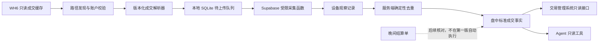

# WH6 Windows 期权成交缓存采集器开发业务需求说明

- 版本：V1.0
- 日期：2026-09-02
- 文档状态：业务设计已确认，第一版 Staging 垂直切片开发中
- 适用项目：轻量化交易管理系统 Web / 交易管理
- 首次实施环境：Windows 11 虚拟机、`staging` 分支、Supabase `LTM WEB STAGING`
- 首个真实验收品种：铁矿石期权
- 关联现有设计：`docs/superpowers/specs/2026-07-12-trading-management-design.md`

## 1. 文档目的

本文定义一个可安装在 Windows 中运行的 WH6 期权成交缓存采集器。采集器从本机 WH6 已写入的盘中缓存中只读提取成交事实，经过账户校验、本地防丢、标准化和多设备去重后，上传至 Supabase 测试库，供现有交易管理系统和受限 Agent 读取。

本文是开发业务需求和总体设计的共同基准，用于约束后续实施计划、代码、测试、安装包和 Staging 验收。本文不代表程序已经开发完成，也不授权修改 Production、正式 Supabase 或正式业务数据。

## 2. 业务结论

本项目最终交付形态为 Windows 安装包，例如 `WH6成交采集器-Setup.exe`。安装完成后，采集器作为 Windows 托盘小程序随当前用户登录自动启动，不要求使用者安装 Python 或手工配置开发环境。

第一版只采集已成交的期权数据，不采集委托、撤单、未成交记录、当前持仓、资金、盈亏或行情。首次运行时补采已绑定账户缓存中全部可可靠识别的历史期权成交；完成首次扫描后，持续采集新增成交。在采集器正常运行、网络正常、服务端正常且 WH6 已完整写入一条缓存记录的条件下，新成交应在 10 秒内进入 Supabase 测试库。

采集器绑定的是一个经过使用者确认的宏源期货账户，而不是某一个固定文件路径。路径变化可以重新发现或手动选择；账户变化、账户身份不明或缓存格式不明时必须暂停，不能猜测、串账或强行上传。

## 3. 业务背景

现有交易管理系统以期货公司日结或月结 TXT 作为确认后的交易事实来源。这类结算材料通常在晚间生成，无法满足盘中及时查看成交、进一步分析或驱动业务 Agent 的需求。

WH6 在 Windows 本地保存盘中成交缓存，因此可以在没有官方交易接口的情况下，以只读方式取得更及时的成交信息。但这一来源存在以下现实问题：

1. 不同电脑、不同安装方式和虚拟机环境中的 WH6 路径不一致，不能硬编码一个路径。
2. 同一台电脑可能存在多个 WH6 用户目录或账户目录，不能把所有目录直接混合。
3. WH6 缓存格式可能随版本变化，旧解析规则不能默认适用于新版本。
4. 多台电脑可能同时读取同一个账户，服务端必须识别同一成交并去重。
5. WH6 正在写文件时，采集器必须避免读取半条记录，更不能影响 WH6 正常运行。
6. 盘中缓存是临时成交证据，不应静默覆盖后续结算单确认的正式事实。

此前的缓存监控方式依赖 Mac 对 Windows 虚拟磁盘的固定挂载路径，只能证明方向可行，不具备跨电脑安装、账户隔离、版本识别、服务端去重和安全凭据管理能力。本项目不延续这种路径绑定方式，而是在 Windows 内部运行通用采集器。

## 4. 业务目标

### 4.1 核心目标

1. 在没有文华或期货公司交易接口的条件下，取得宏源期货账户的盘中期权成交明细。
2. 将新成交从 WH6 完整写入缓存到 Supabase 测试库的正常链路延迟控制在 10 秒以内。
3. 支持当前 Windows 11 虚拟机，并可将同一个安装包迁移至其他真实 Windows 电脑。
4. 支持 WH6 安装位置自动发现和人工选择，不要求每台电脑采用相同路径。
5. 严格绑定指定账户；账户切换、身份不明或来源冲突时自动暂停。
6. 支持同一账户多设备同时采集，服务端只形成一份标准成交事实，同时保留各设备的来源记录。
7. 断网、程序重启或服务端短时不可用时不丢失已经识别的成交，恢复后自动补传。
8. 保持真实交易环境绝对只读，不向 WH6、交易账户或交易界面写入任何内容。
9. 为后续扩展至期货成交、盘中持仓分析和 Agent 读取保留清晰边界，但不提前实现这些功能。

### 4.2 成功结果

完成第一版后，使用者在一台新 Windows 电脑上的目标操作只有：

1. 安装并登录 WH6；
2. 运行 `Setup.exe`；
3. 自动发现或手动选择 WH6 位置；
4. 确认一次脱敏显示的宏源期货账户；
5. 输入一次性设备连接码；
6. 保持采集器在后台运行。

完成设置后，采集器自动补采历史期权成交并持续上传新增成交。使用者不需要操作数据库、填写数据库密码、运行命令或理解缓存文件格式。

## 5. 已确认业务决策

| 编号 | 主题 | 已确认结论 |
| --- | --- | --- |
| D-001 | 数据时效 | 使用 WH6 盘中临时缓存，不等待晚间结算单。 |
| D-002 | 第一版资产范围 | 只处理期权成交，铁矿石期权作为首个真实验收品种。 |
| D-003 | 记录范围 | 只采集已成交记录，不采集委托、撤单和未成交记录。 |
| D-004 | 持仓范围 | “已有成交”不是当前持仓；第一版不直接采集或推断当前持仓。 |
| D-005 | 首次导入 | 导入已绑定账户缓存中全部可可靠识别的历史期权成交。 |
| D-006 | 后续采集 | 首次扫描后增量监控新增成交。 |
| D-007 | 账户切换 | 发现账户变化或身份无法确认时立即暂停并提示。 |
| D-008 | 多设备 | 允许同一账户多台 Windows 电脑同时运行，服务端统一去重。 |
| D-009 | 路径选择 | 优先自动发现 WH6，同时必须允许手动选择读取位置。 |
| D-010 | 运行方式 | Windows 安装版托盘程序，登录 Windows 后自动后台运行。 |
| D-011 | 首轮环境 | 先在当前 Windows 11 虚拟机验证，再验证真实 Windows 电脑。 |
| D-012 | 数据目标 | 第一阶段只连接 Supabase `LTM WEB STAGING`。 |
| D-013 | 实时验收 | 正常条件下，新成交在 WH6 完整写入缓存后 10 秒内进入测试库。 |
| D-014 | 交易时段 | 全天监控缓存；交易时段和节假日不作为采集开关。 |
| D-015 | 安装签名 | 内部测试版允许使用未购买商业代码签名证书的安装包，并接受首次运行可能出现 Windows 安全提醒。 |
| D-016 | Agent 权限 | Agent 只读取服务端整理后的数据，不直接接触 WH6，也没有任何交易工具。 |

## 6. 范围边界

### 6.1 第一版包含

- Windows 自包含安装包和托盘程序；
- 当前 Windows 用户级安装和开机登录自启动；
- WH6 安装位置、用户目录和成交缓存位置的只读发现；
- 手动选择 WH6 根目录或账户数据目录；
- 候选目录有效性校验；
- 单一宏源期货账户首次绑定、脱敏展示和后续一致性检查；
- 账户变化或来源不确定时的自动暂停；
- 已绑定账户下全部可可靠识别的历史期权成交补采；
- 新增期权成交增量监控；
- 缓存版本识别、完整记录判断和未知格式隔离；
- 本地 SQLite 待上传队列、重启恢复和断网重试；
- 设备注册、一次性连接码和可撤销设备令牌；
- 受限的 Supabase Staging 成交写入入口；
- 现有 Web 系统中的管理员“采集设备”最小管理入口，用于生成一次性连接码、查看设备状态和撤销设备；
- 标准成交记录、设备观察记录、去重结果和异常记录；
- 供现有系统和 Agent 使用的服务端只读视图或只读接口；
- Windows 11 虚拟机真实缓存验收；
- 真实 Windows 电脑的安装、路径选择和迁移验收；
- 安装、首次设置、运行状态和故障处理的简明使用说明。

### 6.2 第一版不包含

- 期货成交采集；
- 委托、撤单、未成交或报单状态采集；
- 当前持仓、历史持仓快照、资金余额、保证金或可用资金采集；
- 盈亏、手续费最终值、期权 Greeks、风险指标或行情计算；
- 自动下单、改单、撤单、追单、平仓、行权、资金划转或任何交易操作；
- 通过鼠标键盘、界面自动化或屏幕识别操作 WH6；
- 进程注入、网络抓包、代理拦截或绕过 WH6 安全机制；
- 将盘中缓存自动写成现有结算单确认事实；
- 自动完成盘中缓存与晚间结算单的最终对账；
- 修改现有交易管理页面的统计、持仓、盈亏或业务归属逻辑；
- Production 数据库、正式 Render、正式 Supabase 或正式数据写入；
- Mac 原生版本、移动端版本或浏览器扩展；
- 自动更新系统；
- 商业代码签名证书采购和签名发布；
- 同一台采集器同时绑定并采集多个账户。

### 6.3 后续可扩展方向

以下内容需要在第一版通过真实验收后另行确认：

1. 在同一采集框架中增加期货成交解析；
2. 将盘中临时成交与晚间结算单自动核对并转为确认状态；
3. 以确认的期初持仓和完整成交链重建盘中持仓；
4. 将盘中成交接入现有交易管理页面、风险规则和估值流程；
5. 多账户同时采集和账户配置管理；
6. 正式版部署、正式数据迁移、代码签名和自动更新。

## 7. 业务术语

- **成交记录**：WH6 已经确认成交并写入成交缓存的一条记录。委托、撤单和未成交不是成交记录。
- **已有成交**：采集器首次运行前已经发生、且仍保存在已绑定 WH6 缓存中的成交明细。它不等于当前持仓。
- **新增成交**：采集器进入正常监控状态后，WH6 新写入的完整成交记录。
- **盘中临时成交事实**：来自 WH6 缓存、可用于盘中查看和分析，但尚未经过晚间结算单确认的成交事实。
- **结算确认事实**：来自期货公司日结或月结材料、已按现有交易管理流程确认的事实。
- **账户绑定**：使用者确认一个宏源期货账户后，采集器将该服务端账户、Windows 设备和本地 WH6 数据源建立受控关联。
- **账户指纹**：由稳定账户标识生成的不可逆标记，用于判断当前数据源是否仍属于已绑定账户。路径不是账户指纹。
- **弱绑定**：当前 WH6 版本无法提供稳定账户标识时，使用人工确认和会话变化暂停规则形成的保守绑定。
- **设备标识**：每次 Windows 安装生成的随机唯一标识，用于审计来源，不参与成交事实唯一性判断。
- **观察记录**：某一设备从某一缓存位置看到的一条源记录。多个设备可以观察到同一成交。
- **标准成交事实**：服务端将一个或多个观察记录去重后形成的一条可查询成交记录。
- **回补**：首次运行或重启后扫描缓存中已经存在、但本设备尚未处理的记录。
- **增量采集**：正常运行期间只处理新出现或尚未确认上传的完整记录。
- **隔离记录**：因账户、格式或字段无法可靠确认而不进入标准成交事实的数据或异常摘要。
- **交易日**：WH6 或交易来源记录的业务交易日期；夜盘交易日可能不同于自然日期。

## 8. 使用角色与典型场景

### 8.1 使用角色

- **使用者**：安装采集器、选择 WH6 目录、确认账户并查看运行状态。
- **系统管理员**：在测试系统中生成或撤销一次性设备连接码，查看设备状态和异常摘要。
- **交易管理系统**：通过受保护的服务端接口读取标准化盘中成交。
- **业务 Agent**：通过只读工具读取允许范围内的标准化成交，用于查询、整理和解释。

### 8.2 典型场景

1. 使用者在当前 Windows 11 虚拟机首次安装，软件找到 WH6，使用者确认宏源账户，历史期权成交开始回补。
2. 使用者换到真实 Windows 电脑，安装同一个 `Setup.exe`，手动选择不同位置的 WH6，并绑定到同一服务端账户。
3. 两台电脑同时登录同一宏源账户并看到相同成交，Supabase 只保留一条标准成交事实，并记录两个设备来源。
4. 使用者在 WH6 中切换到其他账户，采集器检测到身份或活动目录变化，在上传任何新账户成交前暂停。
5. 网络中断时，本地继续保存已识别成交；网络恢复后自动补传且不产生重复。
6. WH6 升级后缓存格式变化，采集器将新格式暂停并提示，不使用旧规则错位解析。
7. 节假日或休市期间没有缓存变化，采集器保持空闲，不把“没有成交”判断为故障。

## 9. 总体方案选择

### 9.1 已选择方案

采用“Windows 用户级托盘程序 + 本地可靠队列 + Supabase 受限写入函数 + 服务端标准成交视图”的方案。

Windows 客户端采用开发时仍处于支持期的 .NET LTS 与 WinForms 托盘应用，按 Windows x64 自包含方式发布；安装包使用可脚本化、免费的 Windows 安装器生成单一 `Setup.exe`。实际 SDK、运行时和安装器版本必须锁定在构建清单中，不得改变本文定义的安装、运行、账户绑定、安全和验收行为。

### 9.2 未选择方案及原因

- **单纯脚本**：开发快，但新电脑需要安装运行环境、配置路径和定时任务，不符合普通使用者的一键安装要求。
- **Windows 系统服务**：后台稳定，但通常需要管理员权限，配置界面和服务进程分离，第一版复杂度过高。
- **Mac 读取虚拟磁盘**：依赖 Parallels 挂载路径，无法迁移到真实 Windows 电脑，也容易因挂载名称变化失效。
- **客户端直接持有 Supabase 管理密钥**：会把高权限密钥分发到每台电脑，不满足最小权限要求。

## 10. 系统结构与数据流

### 10.1 Windows 采集器

负责安装、首次设置、路径发现、账户校验、缓存读取、版本解析、本地排队、上传重试和状态提示。采集器只写自己的安装目录和本地数据目录，不修改 WH6 文件、配置、进程或交易账户。

### 10.2 Supabase 受限采集函数

负责验证设备令牌、绑定服务端账户、校验数据结构、限制写入范围、记录设备观察、执行幂等去重并返回逐条确认结果。客户端不能直接更新或删除交易事实，也不能读取其他账户数据。

### 10.3 盘中标准成交事实

盘中成交使用独立表和状态保存，不直接覆盖现有 `trading_trade_facts`。每条数据明确标记为盘中缓存来源和临时状态。后续若增加结算单核对，应建立来源关联和状态升级，而不是删除盘中证据或伪造结算确认。

### 10.4 系统和 Agent 读取层

现有系统和 Agent 只读取脱敏、标准化、权限过滤后的服务端视图或 API。Agent 不读取本地二进制文件、不获得 Supabase 管理权限、不直接连接 WH6，也不能调用任何交易动作。

## 11. Windows 安装与迁移需求

### 11.1 安装包

- 主交付物为单个 Windows 安装包：`WH6成交采集器-Setup.exe`。
- 安装包包含应用运行所需组件，不要求另装 Python 或开发工具。
- 第一版采用当前 Windows 用户级安装，目标是不要求管理员权限。
- 默认安装在当前用户标准应用目录，不依赖 WH6 的安装位置。
- 本地配置和队列保存在当前用户标准应用数据目录，不写入 WH6 目录。
- 安装完成后创建开始菜单入口和托盘程序，并默认启用当前用户登录自启动。
- 用户可以从托盘菜单暂停、继续、打开状态页或退出采集器。

### 11.2 Windows 兼容范围

- 首轮必须在当前 Windows 11 x64 虚拟机完成真实验收。
- 目标兼容 Windows 10/11 x64。
- 在至少一台真实 Windows 电脑完成安装、路径选择、账户绑定和上传验证前，不能宣称实体电脑兼容已经验收。
- 第一版不承诺 Windows ARM、Windows Server 或多用户共享安装。

### 11.3 新电脑迁移

新电脑不复制旧电脑的本地数据库或访问令牌。标准迁移流程为：

1. 安装 WH6 并登录目标宏源期货账户；
2. 复制或下载同一个 `Setup.exe`；
3. 安装并启动采集器；
4. 自动发现或手动选择 WH6；
5. 确认脱敏账户；
6. 输入新的单次设备连接码；
7. 执行首次历史回补。

服务端根据账户和成交身份去重，因此新电脑重新扫描已有缓存不会产生重复标准成交。

### 11.4 升级和卸载

- 第一版使用新安装包覆盖升级，升级必须保留账户绑定、本地队列和已确认事件身份。
- 第一版不开发自动更新。
- 退出或卸载采集器不得修改 WH6。
- 卸载本机程序不删除 Supabase 已上传数据。
- 设备遗失或停用时，由测试系统撤销该设备令牌；撤销后设备不能继续上传。

## 12. WH6 路径发现与手动选择需求

### 12.1 自动发现顺序

采集器按以下只读顺序寻找 WH6，不默认全盘扫描：

1. 当前正在运行的 WH6 进程可执行文件位置；
2. Windows 已安装程序注册信息；
3. 开始菜单和桌面快捷方式目标；
4. 常见安装目录；
5. 已保存的上次有效目录；
6. 使用者手动选择。

读取进程路径只用于定位，不注入进程、不读取进程内存、不发送按键或鼠标操作。

### 12.2 候选目录校验

一个目录只有同时满足以下条件才可以成为候选数据源：

- 能识别为 WH6 安装或用户数据结构；
- 能找到用户或账户相关目录；
- 能找到预期的 `Record` 目录和成交缓存文件；
- 能读取 WH6 版本或其他结构性证据；
- 缓存文件只读打开成功，或明确处于临时占用状态；
- 不位于采集器自身目录或无关软件目录。

采集器必须向使用者显示可理解的候选名称、路径、最近更新时间和脱敏账户线索，不能只显示内部文件名。

### 12.3 手动选择

- 自动发现失败、发现多个候选或使用者主动修改时，必须允许手动选择 WH6 根目录或账户数据目录。
- 选择后先校验，校验失败不得保存为有效来源。
- 手动选择只改变读取位置，不自动改变已绑定账户。
- 新路径与已绑定账户一致时可以继续；不一致或无法确认时进入暂停确认状态。
- 原目录消失、移动或长期不可读时，保留本地待上传队列并提示重新选择，不清空历史状态。

## 13. 账户绑定与切换需求

### 13.1 绑定原则

采集器绑定到一个服务端 `trading_accounts` 账户记录和一个经过确认的本地 WH6 数据源。路径只用于定位，不能单独作为账户身份。

首次绑定流程：

1. 使用者先在 WH6 登录目标宏源期货账户；
2. 采集器定位当前活跃的账户数据目录；
3. 从 WH6 配置、目录元数据或缓存字段中读取可用的期货公司和账户标识；
4. 只显示脱敏账户信息，例如“宏源期货 ****1234”；
5. 使用者确认；
6. 设备连接码将该设备绑定到测试库中的目标账户；
7. 本机保存账户指纹和绑定状态。

完整资金账号不得写入普通日志、错误信息或托盘状态。设备令牌必须保存在 Windows 当前用户的受保护凭据存储中。

### 13.2 强绑定

如果当前 WH6 版本能够提供稳定账户标识，采集器生成账户指纹，并在每次开始扫描、数据源变化、WH6 会话变化和上传前核对：

- 指纹一致：允许采集和上传；
- 指纹不同：立即暂停，不读取或上传新账户的业务记录；
- 指纹缺失或冲突：立即暂停，要求人工确认。

### 13.3 弱绑定降级

如果只读验证证明当前 WH6 版本无法提供稳定账户标识，第一版允许使用已经确认的弱绑定，但必须同时满足：

- 使用者明确选择目标账户目录；
- WH6 进程重启、登录会话变化、活动目录变化或来源结构变化时自动暂停；
- 暂停后由使用者重新确认，不能自动沿用上次账户；
- UI 明确显示“账户需人工确认”，不能标为自动识别成功；
- 未确认期间不上传任何新观察记录。

是否能取得稳定账户标识属于实施前只读验证门，不是未决业务问题。验证结果只决定使用强绑定还是上述已批准的保守降级方式。

### 13.4 账户切换状态

检测到账户变化时：

1. 当前上传队列中已经归属于原账户的记录继续保留；
2. 停止从新来源生成可上传业务事件；
3. 托盘状态变为“已暂停：账户发生变化”；
4. 显示新来源的脱敏线索和原绑定账户；
5. 只有使用者重新登录原账户并验证一致，或执行明确的重新绑定流程后才恢复；
6. 不自动把另一个账户绑定为宏源账户，不按目录名称猜测账户。

## 14. 成交缓存采集需求

### 14.1 数据源

- 第一版以已绑定账户 `Record` 目录中的成交缓存为业务源，`match.dat`（或当前版本对应的成交文件）是已成交事实的唯一来源。
- 第一版只把 `match.dat` 作为已成交事实来源；必要时只读配套 `order.dat` 补齐方向、开平和价格字段，不把订单记录本身引入范围。
- 账户和版本配置只用于定位及身份校验，不作为成交事实本身。
- 原始文件始终由 WH6 管理，采集器不得重命名、移动、截断、覆盖或删除。

### 14.2 历史回补

- 首次运行扫描已绑定账户目录中全部可访问的历史成交缓存。
- 只导入能够可靠识别为期权、账户一致、格式已支持且必需字段完整的成交。
- 不以“今天”为默认起点，也不只读取安装后的新记录。
- 回补过程显示已扫描文件、已识别期权成交、已上传、重复、待处理和隔离数量。
- 初次全量回补不适用 10 秒逐笔实时验收，但不得阻塞对新写入记录的持续捕获。
- 重启、升级或换电脑后的重复回补由本机事件身份和服务端去重共同处理。

### 14.3 增量监控

- 完成基本初始化后，采集器持续监控成交文件变化。
- 优先使用文件变化通知，并使用短周期安全扫描补偿漏通知，满足 10 秒目标。
- WH6 正在写入时只读取已经完整落盘的记录；尾部不足一条完整记录时等待下一次变化。
- 文件被短时锁定时不抢占、不改变共享方式，稍后重试。
- 文件被轮换、缩短或重新生成时，重新核对文件身份和已处理事件，不能简单按旧偏移继续。
- 每次重启先校验历史事件身份，再进入增量状态。

### 14.4 期权识别

- 第一版只把明确识别为期权的记录写入标准事实。
- 铁矿石期权作为首个真实样本和验收品种。
- 保存 WH6 原始合约代码和系统标准化合约代码。
- 看涨/看跌、标的、到期月份和行权价只有在规则可靠时才派生；无法可靠派生时保留原始合约并隔离，不猜测。
- 期货和无法识别的品种不得混入第一版期权事实表。

### 14.5 版本化解析

- 每种已支持 WH6 缓存格式必须有独立解析器版本和样本测试。
- 解析器选择必须基于 WH6 版本、文件结构和记录完整性证据，不能仅凭路径或单一固定长度猜测。
- 新版本、记录长度变化、字段错位、异常字符或校验失败时停止该文件的业务上传。
- 未知格式只记录脱敏异常摘要、文件哈希、大小和版本线索，不把错位内容写入成交事实。
- 支持新格式后必须能够重新扫描原文件，补传此前隔离但仍可读取的记录。

### 14.6 只读要求

采集器对 WH6 的允许操作仅限：

- 查询安装位置和文件元数据；
- 以只读、共享方式打开必要配置和缓存文件；
- 在 `match.dat` 已出现成交的前提下，只读打开同名配套 `order.dat` 关联方向、开平和价格等字段；
- 读取完整记录；
- 计算本地哈希和标准化字段。

禁止操作包括但不限于：

- 写入、锁定、替换或删除 WH6 文件；
- 修改 WH6 注册表或配置；
- 注入或控制 WH6 进程；
- 点击、输入或自动操作交易界面；
- 调用、模拟或构造交易报文；
- 监听、代理或改变交易网络流量。

## 15. 交易时间与日期归属需求

### 15.1 业务参考时段

用户提供的正常交易参考时段为：

1. 早间第一时段：09:00—10:15；
2. 早间第二时段：10:15—11:30；
3. 下午时段：13:30—15:00；
4. 晚间时段：21:00—23:00。

部分节假日不开放交易。以上时段只用于状态说明、数据查询和后续完整性分析，不作为采集器启停条件，也不作为判断“当天应该有成交”的依据。

### 15.2 全天运行

- 采集器随 Windows 登录启动后全天监控。
- 休市和节假日没有新文件变化时保持空闲，不报警、不生成空成交。
- 不依赖外部节假日日历完成核心采集，因此节假日变更不会导致漏采。
- WH6 在非标准时段补写、恢复或重建缓存时，采集器仍能回补。

### 15.3 时间字段

每条标准成交至少区分：

- 来源交易日 `trading_day`；
- 来源成交时间 `trade_time`；
- 可可靠组合时的成交时间戳 `executed_at`；
- 文件最后修改时间 `source_modified_at`；
- 本机首次发现时间 `first_observed_at`；
- 客户端发送时间 `sent_at`；
- 服务端接收时间 `received_at`。

时间统一携带明确时区，业务展示使用北京时间。夜盘交易日优先使用 WH6 来源字段，不能简单按自然日期归属；来源未提供交易日且无法可靠推断时进入待核验，不静默猜测。

## 16. 标准成交数据要求

### 16.1 必需字段

进入标准成交事实的记录必须包含：

- 服务端账户 ID；
- 来源类型：`wh6_intraday_cache`；
- 来源状态：`provisional`；
- 交易日；
- 成交时间或明确的时间缺失状态；
- 交易所；
- WH6 原始合约代码；
- 标准化合约代码；
- 资产类型：`option`；
- 买卖方向；
- 开平标志；
- 成交手数；
- 成交价格；
- 成交编号，如来源可提供；
- 委托编号，如来源可提供；
- 原始记录哈希；
- 解析器版本；
- 首次接收时间和最后观察时间；
- 当前核验状态。

### 16.2 可选字段

来源可靠提供时，可以保存：

- 投机或套保标志；
- 成交额或权利金金额；
- 来源估算手续费，并明确为非结算确认值；
- 看涨或看跌；
- 标的品种、到期月份和行权价；
- WH6 版本；
- 记录在源文件中的稳定位置线索。

缺少可选字段不得伪造默认业务值。特别是手续费、盈亏和持仓不得从不完整缓存推断为最终事实。

### 16.3 数据状态

- `provisional`：盘中缓存已识别，尚未由结算单确认；
- `quarantined`：格式、账户或必需字段无法可靠确认；
- `duplicate_observation`：另一个设备观察到已存在的标准成交；
- `conflict`：同一候选身份出现关键字段不一致，需要人工或后续来源核对；
- `settlement_confirmed`：为后续结算核对预留，第一版不自动生成此状态。

## 17. 本地防丢与队列需求

### 17.1 本地数据库

- 采集器使用独立本地 SQLite 数据库保存配置、文件检查点、事件身份、待上传数据和上传结果。
- 本地数据库不放在 WH6 目录内。
- 采集器异常退出或 Windows 重启后，待上传记录必须继续存在。
- 本机 SQLite 不是正式业务数据库，Supabase 测试库是跨设备汇总后的服务端数据源。

### 17.2 上传语义

- 客户端采用“至少发送一次”，服务端采用幂等写入。
- 只有收到服务端对具体事件的成功或重复确认后，本地事件才标记为已确认。
- 批量请求部分成功时逐条处理，不能把整批误标为完成。
- 超时或未知结果按未确认处理并重试，由服务端幂等规则防止重复。
- 网络恢复后按原顺序补传，不要求使用者手工导出文件。

### 17.3 本地数据最小化

- 待上传期间保存完成重试所需的标准化成交字段。
- 服务端确认后，本地至少保留事件唯一键、原始哈希、来源检查点和确认时间，用于避免重复扫描。
- 不复制或长期保存整份 WH6 原始缓存文件。
- 设备令牌使用 Windows 当前用户受保护凭据存储，不明文写入 SQLite、配置文件或日志。

## 18. Supabase Staging 写入需求

### 18.1 环境边界

- 第一版只允许连接 Supabase `LTM WEB STAGING`。
- 客户端、安装包、配置和测试不得包含正式 Supabase 地址、正式凭据或正式数据。
- Production 接入需要独立的备份、迁移、权限审查、Staging 验收和用户明确确认。

### 18.2 受限写入入口

采用专用 Supabase Edge Function 作为服务端受限入口，业务能力只包括：

- 设备激活；
- 设备心跳；
- 批量提交成交观察；
- 查询本次提交的确认结果。

客户端不得持有 `service_role`、数据库密码或广泛可写密钥。写入入口根据设备令牌在服务端确定账户，不信任客户端自行提交的账户归属。

### 18.3 最小权限

- 设备只能向已绑定账户追加观察记录。
- 设备不能更新或删除标准成交事实。
- 设备不能读取其他账户、其他设备、用户、权限或系统配置。
- 设备令牌在服务端只保存不可逆摘要，并可以单独撤销。
- 所有网络通信使用 TLS。
- 服务端限制单设备请求大小、频率和字段结构，异常请求拒绝并记录脱敏摘要。

### 18.4 建议数据对象

第一版使用独立 `trading_` 前缀对象，并复用现有 `trading_accounts`：

- `trading_collector_pairing_codes`：一次性、生成后 15 分钟内有效的设备连接码；
- `trading_collector_devices`：设备、账户绑定、版本、状态和最后在线时间；
- `trading_intraday_fill_observations`：每台设备看到的源记录，只追加；
- `trading_intraday_fills`：去重后的标准盘中成交事实；
- `trading_collector_issues`：账户、格式、上传和冲突异常；
- 受保护的系统/Agent 只读视图。

实际列定义和迁移 SQL 在实施计划中展开，但不得改变本文的数据身份、状态、权限和来源优先级。

### 18.5 设备管理入口

现有 Web 系统新增管理员可见的“采集设备”最小管理入口，业务能力仅包括：

- 选择现有交易账户并生成一次性、短时有效的设备连接码；
- 查看设备名称、脱敏账户、客户端版本、绑定时间、最后在线时间和当前状态；
- 撤销单台设备；
- 查看该设备的待处理异常数量和最近一条脱敏异常摘要。

普通用户和 Agent 不具有生成连接码或撤销设备的权限。页面不展示设备令牌、完整账户号、Windows 完整路径或数据库凭据。第一版不提供远程启动、远程控制、远程选路或远程操作 WH6 的能力。

### 18.6 数据保留

- Supabase Staging 中的设备观察、标准成交和冲突证据第一版不自动删除，避免测试期间丢失审计链。
- 测试数据必须带有环境、账户、设备和来源时间标识，不能与 Production 数据混用。
- 如需清理 Staging 测试数据，只能按明确设备或明确测试批次执行受控清理，并先验证不会影响其他账户和现有交易事实。
- 本机未确认事件保留到服务端逐条确认；已确认事件的最小身份和检查点保留到软件卸载或使用者明确重置本机采集配置。
- 撤销设备只终止后续上传，不自动删除该设备已有观察或对应标准成交。

## 19. 多设备去重需求

### 19.1 去重原则

- 同一账户的同一成交，无论被多少设备观察，只形成一条标准成交事实。
- 每台设备的观察仍单独保存，用于证明来源和诊断漏采。
- 设备 ID 不得进入标准成交的业务唯一键，否则同一成交会因设备不同而重复。
- 去重不得简单依赖合约、价格和手数，避免误删两笔恰好相同的真实成交。
- 冲突不能通过“最后上传覆盖前一条”处理。

### 19.2 优先唯一键

来源提供可靠成交编号时，标准唯一键优先使用：

`账户 + 交易日 + 交易所 + 成交编号`

委托编号、合约、方向、开平、价格、手数和成交时间用于一致性校验。相同唯一键出现关键字段不一致时标记冲突，不覆盖。

### 19.3 无成交编号时的保守去重

来源没有可靠成交编号时，使用标准化字段签名和同签名出现序号：

`账户 + 交易日 + 成交时间 + 交易所 + 合约 + 买卖 + 开平 + 价格 + 手数 + 可用来源标识 + 同签名序号`

同签名序号用于保留多笔字段完全相同但实际独立的成交。跨设备文件顺序或实例数量不一致、无法证明一一对应时，不自动合并为同一事实，而是进入冲突核对，避免错误删除真实成交。

### 19.4 并发与事务

- 去重必须在数据库唯一约束和单一事务中完成，不能只依赖客户端先查询再插入。
- 并发设备同时上传时，一条成为标准事实，其余成为该事实的观察来源。
- 同一批数据重复发送、重启后重放或请求超时后重试，结果必须一致。

## 20. 托盘界面与运行状态需求

### 20.1 首次设置

首次设置只包含必要步骤：

1. 显示当前连接环境为“测试库”；
2. 自动发现 WH6；
3. 必要时手动选择路径；
4. 显示并确认脱敏账户；
5. 输入设备连接码；
6. 显示首次扫描进度和最终结果。

### 20.2 主状态页

主状态页至少显示：

- 当前状态；
- 绑定账户的脱敏名称；
- 当前 WH6 路径；
- WH6 与解析器版本；
- 最后发现成交时间；
- 最后成功上传时间；
- 本地待上传数量；
- 本次运行已识别、已上传、重复、冲突和隔离数量；
- 当前问题和可执行处理方式。

### 20.3 状态定义

- **未设置**：尚未选择 WH6 或绑定账户；
- **初始化扫描中**：正在回补历史成交；
- **正常监控**：账户和来源有效，正在等待或上传新成交；
- **离线排队**：网络或服务端不可用，本地队列正常；
- **已暂停：账户变化**：当前来源与绑定账户不一致；
- **已暂停：账户待确认**：弱绑定会话变化或身份缺失；
- **已暂停：缓存格式未知**：解析器不能可靠识别；
- **路径不可用**：WH6 位置消失或无权读取；
- **设备授权失效**：令牌过期、撤销或绑定不一致；
- **已退出**：用户主动停止采集器。

### 20.4 提示原则

- 正常休市、节假日和“暂无新成交”不弹出错误提示。
- 只有需要使用者处理的账户、路径、格式或授权问题才显示 Windows 通知。
- 提示使用业务语言说明“是否仍在采集、是否有数据未上传、需要做什么”，不要求使用者阅读日志。
- 所有错误默认失败关闭：不确定时停止相关上传，而不是继续猜测。

## 21. 系统和 Agent 读取需求

### 21.1 系统读取

- 服务端提供按账户、交易日、成交时间、合约和状态筛选的只读接口或视图。
- 返回字段明确区分盘中临时成交和结算确认事实。
- 第一版不将临时成交静默并入现有结算单导入批次，也不触发现有业务归属、平仓匹配或持仓重算。
- 后续接入现有页面时，必须由业务规则决定临时数据如何显示，不能用临时数据覆盖确认数据。

### 21.2 Agent 读取

- Agent 只能通过白名单只读工具查询允许账户的标准化数据。
- Agent 不获得原始 Windows 路径、完整账户号、设备令牌或 Supabase 管理密钥。
- Agent 可以做查询、汇总、解释和异常提示，但第一版不自动修改业务事实。
- Agent 没有下单、改单、撤单、平仓、行权、资金操作或 WH6 控制工具。
- 模型不可用时，确定性的采集、上传、去重和本地提示仍然工作。

## 22. 来源优先级与现有系统关系

### 22.1 来源优先级

1. WH6 盘中缓存：提供及时但临时的成交观察；
2. 期货公司日结/月结材料：提供晚间或历史确认事实；
3. 人工说明：只作为核对备注，不直接覆盖来源事实。

第一版只完成第 1 项采集和独立保存。第 2 项继续由现有交易管理流程负责。

### 22.2 不覆盖原则

- 盘中记录和结算记录分别保留来源。
- 盘中成交不能因字段相似直接改写为结算确认。
- 结算单到达后，即使确认同一成交，也应保留盘中观察的时间和设备来源。
- 盘中与结算不一致时应形成差异，不采用最后写入覆盖。
- 在后续对账功能开发前，盘中表和现有交易事实表保持隔离。

## 23. 非功能需求

### 23.1 时效性

在以下条件同时满足时，一条新增完整成交记录从可被只读读取到 Supabase Staging 接收成功不超过 10 秒：

- 采集器已经完成初始化并处于正常监控；
- WH6 已完整写入该记录；
- 文件没有持续异常锁定；
- Windows 网络正常；
- Supabase Staging 和采集函数正常；
- 设备授权有效。

必须记录 `first_observed_at` 和 `received_at`，以便实际计算链路延迟。初次全量回补、断网补传和未知格式暂停不适用实时 10 秒指标，界面应明确当前状态。

### 23.2 可靠性

- 程序重启不丢待上传事件；
- 重复扫描和重复上传不产生重复标准事实；
- 单个坏文件不影响其他已确认文件和本地队列；
- 客户端升级保留检查点和队列；
- 服务端失败不导致删除本地未确认事件；
- 文件轮换或路径变化不导致静默跳过历史记录。

### 23.3 安全性

- 真实交易账户严格只读；
- 不包含任何交易能力或资金能力；
- 客户端不携带高权限数据库凭据；
- 账户号、路径和令牌在日志中脱敏；
- 未知账户、未知格式和权限异常一律暂停；
- 服务端按设备、账户和能力做最小权限隔离；
- 所有正式环境动作需要后续独立确认。

### 23.4 可维护性

- 账户发现、缓存解析、事件标准化、本地队列、上传和托盘 UI 分成独立模块；
- 缓存解析器按格式版本注册，新增版本不修改旧版本已验证行为；
- 业务唯一键和字段标准化由服务端确定性规则负责，不由 Agent 判断；
- 关键业务规则具有固定编号，并能从测试追溯到本文要求；
- 日志保留必要诊断摘要，不保存整份缓存或秘密信息。

### 23.5 可用性

- 首次安装和迁移不要求使用者执行命令；
- 错误信息给出可执行动作，例如“重新选择路径”或“确认当前账户”；
- 软件关闭、暂停、离线和正常休市必须呈现不同状态；
- 安装包能够在无开发环境的新 Windows 电脑运行。

## 24. 异常处理规则

| 异常 | 系统行为 | 数据影响 | 使用者动作 |
| --- | --- | --- | --- |
| WH6 未安装或未找到 | 保持未设置，不全盘盲扫 | 不产生数据 | 手动选择或先安装 WH6 |
| WH6 未运行 | 保留队列，等待文件变化 | 已上传数据不受影响 | 无需操作 |
| 路径失效 | 暂停新读取 | 队列继续保留 | 重新选择路径 |
| 发现多个账户目录 | 不自动合并 | 不上传未确认目录 | 选择目标账户 |
| 账户指纹变化 | 立即暂停 | 原账户队列保留，新账户不上传 | 登录原账户或重新绑定 |
| 账户身份无法读取 | 进入弱绑定确认 | 未确认期间不上传 | 人工确认 |
| 文件正在写入或锁定 | 等待并重试 | 不读取半条记录 | 通常无需操作 |
| 缓存版本未知 | 隔离并暂停该文件 | 不生成错误成交 | 等待解析器升级 |
| 单条字段不完整 | 隔离该条并记录摘要 | 其他可靠记录继续 | 查看异常摘要 |
| 网络断开 | 本地排队 | 不丢已识别记录 | 网络恢复后自动补传 |
| 服务端超时 | 保持未确认并重试 | 服务端幂等防重复 | 通常无需操作 |
| 设备令牌失效 | 停止上传 | 本地队列保留 | 重新连接设备 |
| 多设备重复 | 合并标准事实，保留观察 | 标准事实不重复 | 无需操作 |
| 相同身份关键字段冲突 | 不覆盖，标记冲突 | 待核验 | 后续人工或结算核对 |
| 休市或节假日无成交 | 显示正常监控、暂无新成交 | 不产生空记录 | 无需操作 |

## 25. 验收标准

### 25.1 安装与迁移

- AC-001：在当前 Windows 11 虚拟机双击 `Setup.exe` 可完成安装，无需 Python。
- AC-002：安装后托盘程序可启动，并能在下次登录 Windows 后自动运行。
- AC-003：程序运行在 Windows 内部并读取 Windows 路径，不依赖 Mac `/Volumes` 挂载路径。
- AC-004：在一台路径不同的真实 Windows 电脑安装同一安装包，可重新发现或手动选择 WH6。
- AC-005：覆盖升级后账户绑定、待上传队列和已处理事件身份仍存在。

### 25.2 路径与账户

- AC-010：自动发现一个有效 WH6 时能够展示并通过结构校验。
- AC-011：自动发现失败时，使用者可以手动选择有效目录并保存。
- AC-012：选择无关目录时明确拒绝，不进入采集状态。
- AC-013：首次绑定显示脱敏宏源账户信息，完整账户号不进入普通日志。
- AC-014：切换到另一个账户或测试目录后，在上传新来源成交前进入暂停状态。
- AC-015：身份无法稳定读取时按弱绑定规则暂停确认，不宣称自动识别成功。

### 25.3 历史成交

- AC-020：首次扫描导入已绑定账户缓存中全部可可靠识别的历史期权成交。
- AC-021：第一版导入结果只含期权，不含期货、委托、撤单和未成交。
- AC-022：铁矿石期权真实样本的合约、方向、开平、手数、价格、交易日和成交时间与 WH6 只读显示或可靠源记录一致。
- AC-023：无法识别的旧格式或异常记录进入隔离摘要，不产生错位成交。
- AC-024：重新扫描同一历史缓存不会增加重复标准成交。

### 25.4 实时成交

- AC-030：由使用者正常交易自然产生、WH6 已完整写入的一条期权成交，在正常条件下 10 秒内出现在 Supabase Staging。
- AC-031：测试记录保留来源交易日、成交时间、本机发现时间和服务端接收时间，可复核延迟。
- AC-032：文件尾部暂不完整时不上传半条记录，记录完整后再上传。
- AC-033：采集器运行期间跨休市时段或夜盘继续工作，不因固定定时器漏采。
- AC-034：夜盘记录按 WH6 来源交易日保存，不只按自然日期归类。

真实成交验收只观察使用者自然产生的交易，Codex、Agent、脚本和测试程序不得为了验收发起、修改或取消任何真实委托。

### 25.5 多设备与可靠性

- AC-040：两台设备上传同一可靠成交后，标准成交表只有一条，观察记录能看到两个设备来源。
- AC-041：两笔字段完全相同但实际独立的成交不因简单字段签名被误删。
- AC-042：请求超时后重复上传，结果仍只有一条标准成交。
- AC-043：断网期间产生的可识别成交进入本地队列，恢复网络后自动补传。
- AC-044：强制关闭并重启程序后，未确认队列继续上传，已确认记录不重复。
- AC-045：Supabase 暂时拒绝或不可用时，WH6 文件不受影响，本地事件不被丢弃。

### 25.6 安全和环境

- AC-050：安装包、配置、日志和本地 SQLite 中不存在 Supabase `service_role`、数据库密码或正式环境凭据。
- AC-051：文件内容哈希证明采集前后 WH6 成交缓存未被修改。
- AC-052：程序不包含任何下单、撤单、改单、行权、资金或 WH6 控制入口。
- AC-053：全部服务端写入只发生在 `LTM WEB STAGING`，Production 代码、数据库、环境变量和数据保持不变。
- AC-054：撤销设备令牌后，设备无法继续上传，但已确认的 Staging 记录不被客户端删除。
- AC-055：Agent 只能通过受保护的只读接口看到标准化数据，无法取得原始凭据或执行交易。
- AC-056：管理员可以在 Staging“采集设备”入口为指定账户生成一次性连接码、查看设备状态并撤销设备；普通用户和 Agent 无此权限。

## 26. 测试策略

### 26.1 解析器单元测试

至少覆盖：

- 已知 WH6 版本和已确认 `match.dat` 样本；
- 多条连续记录；
- 文件尾部半条记录；
- 空文件；
- 文件轮换和缩短；
- 未知记录长度和字段错位；
- 中文编码、空字段和异常数值；
- 期权与期货分类；
- 看涨、看跌、行权价等可选派生字段；
- 交易日和夜盘时间；
- 两条字段相同但独立成交的实例序号。

合成样本用于覆盖边界，但不能代替真实 WH6 样本验收。

### 26.2 客户端集成测试

至少覆盖：

- 自动和手动路径选择；
- 强绑定和弱绑定；
- 账户切换暂停；
- 首次回补与运行中新增记录并行；
- 文件锁定重试；
- 本地队列重启恢复；
- 网络断开和恢复；
- 服务端逐条确认；
- 令牌撤销；
- 覆盖升级保留状态；
- 自启动和托盘退出。

### 26.3 服务端测试

至少覆盖：

- 一次性连接码只能使用一次，并且只能在生成后 15 分钟内使用；
- 设备只能绑定指定账户；
- 设备令牌校验、撤销和最小权限；
- 必需字段和批量大小校验；
- 相同设备重放；
- 多设备并发上传；
- 有成交编号和无成交编号两类去重；
- 相同身份关键字段冲突；
- 观察记录和标准事实事务一致；
- RLS、函数权限和 Agent 只读范围。
- 管理员设备连接码生成、一次使用、过期和撤销流程。

### 26.4 Windows 11 虚拟机真实验收

使用当前 Windows 11 虚拟机和真实 WH6 缓存，完成：

1. 安装包安装；
2. WH6 路径发现；
3. 宏源账户绑定；
4. 全历史期权成交回补；
5. 选取真实记录逐字段核对；
6. 观察使用者自然产生的新成交并验证 10 秒时效；
7. 账户切换或等价安全测试；
8. 断网、重启和重复上传测试；
9. Supabase Staging 数据回读；
10. WH6 文件未修改证明。

### 26.5 真实 Windows 迁移验收

在与虚拟机路径不同的真实 Windows 电脑，至少验证安装、手动选路、账户绑定、历史回补、新成交上传和去重。未完成这一步时，只能声明虚拟机版本通过，不能声明多电脑部署完成。

## 27. Golden Cases

| 编号 | 场景 | 预期结果 |
| --- | --- | --- |
| GC-001 | 首次运行时缓存已有多日铁矿石期权成交 | 全部可靠记录进入 Staging，首次扫描不只取当天。 |
| GC-002 | WH6 新增一条完整期权成交 | 正常条件下 10 秒内进入 Staging。 |
| GC-003 | 同一账户两台电脑看到同一成交 | 一条标准事实、两条设备观察。 |
| GC-004 | 同一账户真实产生两笔字段完全相同的成交 | 两笔事实都保留，不因简单去重误删。 |
| GC-005 | WH6 文件尾部只有半条新记录 | 不上传；补全后再上传一次。 |
| GC-006 | 网络中断后连续出现多条成交 | 本地完整排队，恢复后按幂等规则补传。 |
| GC-007 | 采集器在未确认上传时被关闭 | 重启后继续，不丢失、不重复。 |
| GC-008 | 使用者切换到另一个账户 | 上传前暂停，新账户数据不进入原账户。 |
| GC-009 | WH6 升级产生未知格式 | 隔离并提示，不按旧格式强行解析。 |
| GC-010 | 夜盘 21:00 后产生成交 | 同时保存实际时间和来源交易日。 |
| GC-011 | 节假日全天无成交 | 显示正常监控，无错误、无空记录。 |
| GC-012 | 新电脑路径与虚拟机完全不同 | 手动选择后绑定同一账户，历史重扫不重复。 |

## 28. 分阶段实施门禁

### 阶段 0：只读可行性验证

目标：确认当前 WH6 版本的成交记录结构、期权字段、稳定成交编号和稳定账户标识。

门禁：

- 只读，不修改 WH6；
- 输出支持的格式证据和字段映射；
- 明确账户采用强绑定还是已批准的弱绑定；
- 无法可靠识别时停止，不进入正式解析开发。

### 阶段 1：服务端 Staging 基础

目标：建立设备、观察、标准成交、异常和受限写入入口。

门禁：

- 只连接 `LTM WEB STAGING`；
- 数据库迁移前按项目规则备份 Staging；
- 完成权限、幂等、并发和去重自动化测试；
- 客户端不存在高权限密钥。

### 阶段 2：Windows 采集器

目标：完成安装、发现、绑定、解析、本地队列、上传和状态界面。

门禁：

- 合成和脱敏样本测试通过；
- 未知格式、账户变化、断网和重启均按本文规则处理；
- 不包含任何交易能力。

### 阶段 3：Windows 11 虚拟机端到端验收

目标：以真实 WH6 缓存证明历史完整性、字段正确性、实时性和只读安全。

门禁：

- 真实样本逐字段核对；
- 自然产生的新成交满足 10 秒；
- 多设备去重可使用第二测试实例验证；
- WH6 文件内容未修改；
- Staging 数据可由受限只读接口回读。

### 阶段 4：真实 Windows 电脑迁移验收

目标：证明安装包不依赖 Parallels、Mac 挂载路径或特定 WH6 安装位置。

门禁：

- 新电脑独立安装成功；
- 自动发现或手动路径选择成功；
- 账户重新绑定成功；
- 历史回补和新增成交正常；
- 与已有设备重复数据被正确合并。

### 阶段 5：后续 Gate B

阶段 0—4 完成后，只能提交是否进入正式环境的 Gate B 材料。合并 `main`、Production 部署、正式 Supabase 迁移、正式设备连接和正式数据写入仍需用户另行明确授权。

## 29. 风险与控制

| 风险 | 影响 | 控制措施 |
| --- | --- | --- |
| WH6 缓存格式升级 | 错位解析或漏采 | 版本化解析、完整性校验、未知格式暂停、真实样本回归。 |
| 缓存不含稳定账户号 | 无法自动识别切换 | 使用已批准的弱绑定、会话变化即暂停、人工确认。 |
| 多个账户目录同时存在 | 串账 | 单账户白名单、活动来源确认、不自动合并目录。 |
| 同一成交被多设备上传 | 重复事实 | 服务端唯一约束、事务幂等、设备观察与标准事实分离。 |
| 两笔真实成交字段相同 | 错误去重 | 优先成交编号；否则使用同签名序号并对不确定情况标冲突。 |
| 文件正在写入 | 半条或损坏记录 | 完整记录边界、只读共享、稳定后再读。 |
| 缓存历史不完整 | 无法还原完整持仓 | 第一版不承诺持仓；以后用期初持仓或结算单补足。 |
| 断网或服务端故障 | 延迟或丢失 | 本地持久队列、逐条确认、幂等补传。 |
| 客户端密钥泄露 | 越权写入 | 一次性连接码、设备令牌、最小权限、可单设备撤销。 |
| 未签名安装包被提醒 | 安装体验受影响 | 内部说明首次安全提醒；正式广泛分发前再采购签名。 |
| 虚拟机验证被误当作全平台完成 | 新电脑安装失败 | 实体 Windows 验收单独设门，未验证不得宣称完成。 |
| 盘中数据被当作最终结算 | 业务判断错误 | 明确 `provisional` 状态，与现有结算事实隔离。 |

## 30. 停止与升级条件

出现以下任一情况，采集器或实施流程必须停止相关上传并返回验证：

- 无法证明当前目录属于已绑定账户；
- 当前账户与绑定账户不一致；
- 缓存格式、字段边界或编码无法可靠识别；
- 无法区分期权与期货；
- 去重规则可能合并两笔真实成交且没有可靠消歧依据；
- 客户端需要高权限 Supabase 密钥才能继续；
- 实现要求触碰 WH6 写入、进程控制、网络拦截或交易操作；
- 目标数据库环境无法确认是 Staging；
- 需要修改 Production、正式数据或正式环境变量；
- 实际需求扩展到期货、持仓、盈亏或自动业务处理。

前五项属于数据可靠性门禁，必须优先保证“不上传”而不是“可能上传错”。后五项属于范围和权限门禁，需要重新设计或获得相应授权。

## 31. 发布与回滚边界

### 31.1 开发与 Staging

- 开发在 `codex/*` 功能分支或 `staging` 分支进行。
- 服务端只使用 Supabase `LTM WEB STAGING`。
- Staging 数据库变更前按 `docs/backup_restore.md` 执行备份和恢复验证。
- 测试数据使用明确标记的测试设备、测试批次和真实只读缓存观察。
- 真实页面或接口验收必须核对环境、版本、账户范围和数据回读，不能只以接口成功状态代替业务验收。

### 31.2 客户端回滚

- 使用者可以从托盘暂停或退出采集器；
- 可以取消自启动或卸载安装包；
- 服务端可以撤销单台设备令牌；
- 客户端回滚不修改 WH6，也不删除服务端已经确认的观察和标准成交；
- 升级失败时可以安装上一已验证版本，并继续使用兼容的本地队列格式。

### 31.3 服务端回滚

- 采集入口可以停用，客户端保留本地队列；
- 新增 Staging 表与现有结算事实表隔离，旧系统不读取时可以保留而不影响现有功能；
- 数据迁移回滚不得删除无法重建的观察证据；
- Production 不在本文件授权范围内。

## 32. 需求追溯矩阵

| 业务目标 | 关键需求 | 验收证据 |
| --- | --- | --- |
| 盘中及时取得成交 | 增量监控、本地队列、受限写入 | AC-030—AC-034 |
| 新电脑可直接安装 | 自包含 Setup、自动/手动选路 | AC-001—AC-005、AC-010—AC-012 |
| 只采集宏源目标账户 | 账户白名单、强/弱绑定、切换暂停 | AC-013—AC-015 |
| 历史数据不遗漏 | 全缓存回补、版本解析、重扫幂等 | AC-020—AC-024 |
| 多设备不重复 | 标准事实与观察分离、服务端事务去重 | AC-040—AC-042 |
| 断网和重启不丢失 | SQLite 队列、逐条确认、自动补传 | AC-043—AC-045 |
| 真实交易绝对只读 | 文件只读、无交易工具、最小权限 | AC-050—AC-055 |
| 不污染正式系统 | Staging 隔离、临时事实独立表 | AC-053、阶段 1—5 |

## 33. 预期实施交付物

后续实施完成后应交付：

1. Windows 采集器源代码；
2. 自包含 Windows 安装包 `WH6成交采集器-Setup.exe`；
3. Supabase Staging 数据迁移和受限采集函数；
4. 系统/Agent 只读视图或接口；
5. 解析器、客户端、服务端和安全测试；
6. Windows 11 虚拟机真实验收记录；
7. 真实 Windows 电脑迁移验收记录；
8. 简明安装和使用说明；
9. Staging 回滚说明；
10. 后续是否进入 Production 的 Gate B 材料。

## 34. 完成定义

只有同时满足以下条件，第一版才可以称为“开发完成并通过 Staging 验收”：

- 本文第一版范围内的功能全部实现；
- 所有目标自动化测试通过；
- 当前 Windows 11 虚拟机真实缓存验收通过；
- 历史期权成交的数量和关键字段可与来源复核；
- 使用者自然产生的新成交满足 10 秒要求；
- 多设备、断网、重启、账户切换和未知格式 Golden Cases 通过；
- WH6 文件内容未被修改，程序不存在任何交易能力；
- Supabase 写入只发生在测试库；
- 系统或 Agent 能通过受限只读接口读取标准化盘中成交；
- 已知限制、解析器版本和真实 Windows 迁移状态如实记录；
- 未将虚拟机通过、自动化测试通过或接口返回成功包装成 Production 完成。

本文没有遗留的业务选择项。当前 WH6 是否提供稳定账户标识、稳定成交编号以及当前版本的完整字段布局，由阶段 0 只读验证决定；验证失败时使用本文已经定义的保守降级或停止规则，不另行猜测业务含义。
