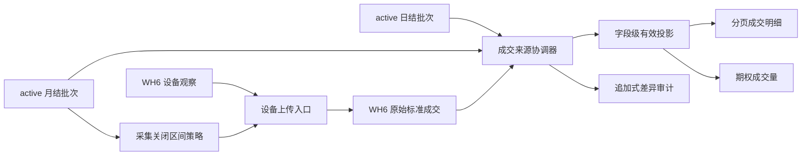

# WH6 月结单治理、数据纠错与覆盖升级修复设计

- 版本：V2.1 设计基线
- 日期：2026-09-04
- 文档状态：业务规则已确认，待按实施计划在 Staging 开发和验收
- 适用模块：WH6 Windows 采集器、交易结算事实层、采集设备后台页面
- 首个实施环境：Staging / Supabase `LTM WEB STAGING`
- Production 状态：仅固化同一规则，不授权本设计阶段发布或修改正式数据
- 上位设计：`docs/superpowers/specs/2026-09-03-wh6-intraday-fills-positions-collector-design.md`

## 1. 目标

修复“V2 已覆盖安装但实际仍按旧逻辑运行、历史缓存持续占用上传队列、盘中数据与结算单没有形成统一优先级、后台一次固定显示 100 条且不能翻页”的完整链路。

最终结果应满足：

1. 是否继续采集或上传某个历史月份，只由该账户、该环境中已经生效的完整月结单决定。
2. 日结单不能关闭月份，也不能推进历史采集边界。
3. 月结单、日结单都可以补全和修正 WH6 临时成交；字段冲突遵循“月结单 > 日结单 > WH6”。
4. 高优先级来源没有提供的字段不得清空低优先级有效值，例如结算单没有成交时间时保留 WH6 成交时间。
5. 跨期组合保存为一笔组合成交，不拆成两个单腿，不计入期权成交量。
6. 后台成交明细默认 20 条，支持 20/50/100 和真正的服务端翻页。
7. Windows 用户只需运行自包含 Setup 覆盖安装；目标虚拟机不安装 Python、不重新选择路径、不重复输入连接码。
8. Staging 与未来 Production 使用同一套确定性规则，但各自只依据本环境中真实生效的月结批次。

## 2. 当前已确认事实

### 2.1 V2 安装无效不是单一安装失败

当前调查证明了多个因素叠加：

- 已安装 EXE 与当时构建出的 V2 文件哈希一致，说明文件覆盖本身成功。
- 本地 `config.json` 仍保存旧 `client_version=0.1.0`，运行时继续上报旧版本，导致后台无法可靠判断实际程序版本。
- 当前公开 Staging 仍只具备 V1 能力；成交接口存在，但 V2 的持仓和期权成交量接口未在真实 Staging 生效。
- V1 检查点已把旧文件标为扫描完成，V2 即使新增期货能力，也不会自动重新解析这些文件。
- V1 与 V2 的事件键格式不同，当前本地队列因此形成 6 组别名重复。
- 上传一次认领 500 条、HTTP 超时 8 秒、失败没有指数退避，历史积压会持续占用上传机会。

因此，修复必须按“服务端兼容能力 -> 本地迁移 -> 新安装包”的顺序完成，不能只再次覆盖 EXE。

### 2.2 真实只读样本结论

当前只读样本快照中：

- WH6 普通成交覆盖 2026-06-15 至 2026-09-04，共 2,998 笔，其中期货 520 笔、期权 2,478 笔。
- 另有 72 笔当前解析器未识别的跨期组合成交，分布在 7 月和 8 月。
- 已找到 2026 年 6、7、8 月三个真实月结单文件。
- 6—8 月 WH6 的 2,720 笔普通成交全部能在对应月结单中按日期、交易所、合约、买卖、开平、数量、价格和成交编号精确匹配。
- 本地队列快照有 2,484 行，规范化后为 2,478 笔唯一期权成交；其中 6—8 月有 2,297 条。
- 这些文件存在并可解析，不等于它们已在 Staging 或 Production 的 `trading_import_batches` 中处于 `active`。环境内生效状态必须在执行时单独核验。

上述数量是设计时证据快照，不作为未来运行时硬编码常量。迁移和验收必须重新计算实际数量。

## 3. 核心业务规则

### 3.1 “已生效月结单”的严格定义

一个月份只有同时满足以下条件，才能成为采集关闭区间：

- 批次账户与采集设备绑定账户一致；
- `trading_import_batches.status = 'active'`；
- `statement_type = 'monthly'`；
- 类型来自结算单正文期间，而不是文件名猜测；
- `range_start` 是该自然月第一天；
- `range_end` 是该自然月最后一天；
- 起止日期属于同一自然月；
- 批次确认事务已提交完成。

`preview`、`confirmed` 兼容旧状态、`superseded`、解析失败、日期范围不完整或只有本地文件的月结单都不能关闭月份。

### 3.2 按明确月份覆盖，不使用“最大日期一刀切”

服务端返回明确的 `closed_ranges`，客户端逐个交易日判断是否落在已关闭区间内。

例如 6 月和 8 月月结单有效、7 月缺失时：

- 6 月和 8 月历史缓存不再上传；
- 7 月仍视为未闭合，必须允许补采；
- 页面不能显示“已结算至 8 月 31 日”这种掩盖缺口的结论；
- 应显示“已覆盖 6 月、8 月；7 月缺口待补”。

该规则避免单一 `MAX(range_end)` 跳过中间缺月。

### 3.3 日结单的边界

日结单可以：

- 补齐 WH6 缺失的手续费、成交额、投保属性、权利金、平仓盈亏等字段；
- 修正同一成交的合约、买卖、开平、数量或价格冲突；
- 建立当天临时事实与结算事实的来源关联；
- 作为当月尚未月结时的当前高优先级事实。

日结单不可以：

- 将整个自然月标记为已关闭；
- 阻止 WH6 继续采集该月后续成交；
- 将历史队列中的整月数据批量标记为月结覆盖；
- 覆盖已经生效的月结单字段。

### 3.4 字段级来源优先级

同一成交的有效字段按以下优先级解析：

| 优先级 | 来源 | 作用 |
| --- | --- | --- |
| 200 | 已生效月结单 | 月度最终事实和月份关闭依据 |
| 100 | 已生效日结单 | 月中或月末前的补全、纠错依据 |
| 0 | WH6 缓存 | 盘中及时事实及结算单缺失字段来源 |

字段处理规则：

- 高优先级来源对其明确提供的字段拥有最终值。
- 高优先级字段为 `null`、空字符串或来源本身没有该字段时，保留下一优先级的有效值。
- 月结单与日结单冲突时月结单获胜；同优先级新版本沿用现有事实版本与差异审计机制。
- WH6 的成交时间、成交时间戳、委托编号、来源路径摘要、原始记录哈希、记录序号和解析器版本始终作为 WH6 来源证据保留。
- 原始设备观察和原始结算来源行不可因纠错而物理删除。

### 3.5 成交身份和冲突

优先身份键：

`账户 + 交易日 + 标准交易所 + 标准成交编号`

标准化规则：

- 交易所统一到 `dce/shfe/czce/cffex/ine/gfex` 等内部代码；中文简称和英文代码映射到同一值。
- 纯数字成交编号移除无意义前导零；含字母编号转小写并去首尾空格，不删除内部字符。
- 找到唯一候选后，再核对标准合约、买卖、开平、数量和价格。

结果状态：

- `matched_daily`：与日结单一致；仍属未月结月份。
- `corrected_daily`：日结单修正了 WH6 一个或多个字段；仍继续采集该月。
- `matched_monthly`：与月结单一致，记录进入月结覆盖状态。
- `corrected_monthly`：月结单修正了 WH6 字段，月结值生效并保留差异。
- `monthly_unmatched`：月份已关闭但 WH6 记录在月结单中没有唯一对应；不进入正常统计，作为异常保留。
- `ambiguous`：存在多个候选，不能自动决定；不猜测合并。
- `unmatched`：尚无日结/月结来源。

没有可靠成交编号时，只允许在“日期、交易所、合约、买卖、开平、数量、价格”组合得到唯一候选时建立关联；两个或更多候选一律标记 `ambiguous`。

### 3.6 整条成交缺失与字段缺失的区别

- 月结单缺少某个字段：保留日结单或 WH6 的该字段。
- 完整月结单中完全没有某笔日结成交：该日结事实不再作为当前事实，保留历史版本并记录 `absent_from_monthly` 差异。
- 完整月结单中没有某笔已上传 WH6 成交：该 WH6 记录标记 `monthly_unmatched`，不计入正常成交量，供异常核对。

### 3.7 跨期组合

- 跨期组合按一笔标准成交保存，`asset_type = 'future_spread'`。
- 保存原始组合代码及标准化后的两腿标识，但不生成两个单腿成交事实。
- 组合成交不进入第一阶段期权成交量或期权持仓统计。
- 已被有效月结单覆盖的 7—8 月历史组合不重新作为 WH6 临时事实上传；只保留本地迁移审计。
- 实施前必须用现有真实缓存的脱敏样本锁定 WH6 实际组合编码格式；未验证的格式不得通过猜测正则放行。

## 4. 服务端架构



新增职责集中在 `backend/app/trading_collector_reconciliation.py`：

- 结算交易所和成交编号标准化；
- 计算设备绑定账户的有效月结关闭区间；
- 将 WH6 成交与当前有效结算成交匹配；
- 生成字段级有效值、字段来源和差异；
- 月结确认后关闭对应历史临时事实；
- 日结/月结确认后重跑对应日期范围的协调；
- 为已有 Staging 数据提供可重复、幂等的 dry-run/apply 修复入口。

`trading_collector_service.py` 继续负责设备鉴权、观察写入、标准成交幂等和查询，不承担结算导入本身。

## 5. 数据模型

### 5.1 结算成交键

为 `trading_trade_facts` 增加：

- `transaction_no TEXT`：原始成交编号；
- `normalized_transaction_no TEXT`：匹配用标准成交编号。

确认日结/月结时直接写入；既有有效结算事实通过 `trading_source_rows.raw_json` 幂等回填。回填失败的行保持空值并进入无编号降级匹配，不伪造成交编号。

### 5.2 WH6 成交协调状态

为 `trading_intraday_fills` 增加：

- `reconciliation_status TEXT NOT NULL DEFAULT 'unmatched'`；
- `settlement_identity_id INTEGER NULL`；
- `settlement_batch_id INTEGER NULL`；
- `effective_source TEXT NOT NULL DEFAULT 'wh6'`；
- `reconciled_at TEXT NULL`。

`data_status` 保留并扩展：

- `provisional`：未被月结关闭；
- `settlement_covered`：月结已匹配或已按月关闭；
- `settlement_conflict`：月结月份内无法唯一匹配，需要核对。

### 5.3 追加式协调审计

新增 `trading_intraday_fill_reconciliations`：

- `id`；
- `intraday_fill_id`；
- `account_id`；
- `settlement_identity_id`；
- `settlement_batch_id`；
- `authority_type`；
- `source_priority`；
- `result_status`；
- `resolved_fields_json`；
- `field_sources_json`；
- `differences_json`；
- `is_current`；
- `created_at`。

每次更高优先级来源或同优先级新版本到达时，旧协调行改为非当前并新增一行；不覆盖历史审计内容。

### 5.4 索引和权限

至少增加：

- 结算成交按日期、交易所和标准成交编号的索引；
- WH6 成交按账户、状态、日期和 ID 的分页索引；
- 协调表按 WH6 成交、当前状态和结算身份的索引。

新增表必须启用 RLS，并撤销 `anon`、`authenticated` 直接表权限；Windows 客户端仍只持有设备令牌，不持有 Supabase 密钥。

## 6. 设备采集策略接口

新增设备令牌保护的只读接口：

`GET /api/trading-collector/device/collection-policy`

响应合同：

```json
{
  "schema_version": 1,
  "policy_revision": "sha256",
  "minimum_client_version": "0.2.1",
  "capabilities": [
    "monthly_collection_ranges_v1",
    "per_item_ingest_receipts_v1",
    "future_spread_v1",
    "positions_v2"
  ],
  "closed_ranges": [
    {
      "month": "2026-08",
      "range_start": "2026-08-01",
      "range_end": "2026-08-31",
      "source_batch_id": 1
    }
  ],
  "generated_at": "2026-09-04T00:00:00+00:00"
}
```

约束：

- 只返回设备所绑定账户的范围；客户端不能传账户 ID 改写范围。
- `closed_ranges` 只来自有效完整月结单，绝不包含日结单。
- `policy_revision` 对排序后的有效范围及最低客户端版本计算稳定哈希。
- 新安装首次无法取得策略时，仅允许处理当前交易日实时数据，历史扫描保持暂停。
- 缓存策略过期且无法刷新时，当前交易日仍可采集，历史数据保持不动，状态显示“历史策略不可用”。

## 7. 上传与逐条回执

客户端每批最多上传 100 个项目，服务端逐条返回：

```json
{
  "accepted": 1,
  "duplicates": 0,
  "settlement_covered": 0,
  "conflicts": 0,
  "quarantined": 0,
  "fill_results": [
    {"event_key": "tradeid:2026-09-04:dce:123", "status": "accepted"}
  ]
}
```

终态处理：

- `accepted`、`duplicate`、`settlement_covered`：本地确认，不再重传。
- `conflict`、`quarantined`：本地移入对应终态并保留错误，不进入无限重试。
- 网络超时、HTTP 5xx 或无法判断结果：释放回 `pending`，按 5、10、20、40、80、160、300 秒上限退避。
- HTTP 401/403：暂停设备上传并提示重新连接，不丢本地队列。

服务端即使遇到旧客户端或策略竞态，也必须再次检查月结覆盖，不能仅依赖客户端跳过。

## 8. 本地 SQLite 迁移

V2.1 首次启动按单一事务执行：

1. 在 `%LOCALAPPDATA%\WH6成交采集器\backups` 创建一次数据库备份；
2. 写入本地 schema 版本；
3. 把旧 `client_version` 从持久配置中移除，运行时只使用程序内版本常量；
4. 将 V1 `tradeid:<id>` 迁移为 `tradeid:<date>:<exchange>:<normalized-id>`；
5. 合并新旧键指向同一成交的别名，保留较强终态和完整审计；
6. 将残留 `claimed` 恢复为 `pending`；
7. 根据最新月结策略把覆盖月份的 `pending/claimed` 历史成交改为 `covered_by_monthly`；
8. 为未关闭月份的旧检查点写入新解析器版本，触发一次受控重扫，以补齐 V2 新增的期货和组合成交；
9. 迁移成功后保留备份，不自动删除。

终态强度：`acked > covered_by_monthly > quarantined/conflict > pending > claimed`。合并时不得把已经确认的记录降回待上传。

如果迁移失败，程序停止历史扫描并继续保留原数据库及备份，不创建空库替代。

## 9. 页面与统计

### 9.1 成交列表

`GET /api/trading-collector/fills` 改为：

- 默认 `page=1&page_size=20`；
- `page_size` 仅允许 20、50、100；
- 服务端 `COUNT(*)` 后只返回当前页；
- 排序固定为 `trade_date DESC, trade_time DESC, id DESC`；
- 响应包含 `items/page/page_size/total_items/total_pages`；
- 默认不返回 `settlement_covered`，月结冲突以明确异常状态显示；
- 原有账户、日期、合约和权限过滤保持。

前端复用交易管理的分页视觉结构，支持上一页、下一页、20/50/100；账户、筛选或页大小变化时回到第 1 页。

### 9.2 期权成交量

成交量聚合不能从当前页或固定 500 条列表相加。服务端必须对当天全部有效期权成交做独立聚合：

- 排除 `settlement_covered` 和 `settlement_conflict`；
- 排除 `future` 与 `future_spread`；
- 日结已经纠错的未月结成交使用日结有效字段；
- 同一标准成交只计一次；
- 明细分页不影响总手数和分组汇总。

## 10. 覆盖安装与文件整理

### 10.1 用户侧安装

- 安装包版本固定为 `0.2.1`，程序、Inno Setup 和后台上报共用一个版本源。
- 沿用原 AppId 和默认安装目录，Setup 自动识别旧版本并原位覆盖。
- 应用运行时通过单实例互斥避免重复启动；安装器通过 Windows Restart Manager 自动关闭正在使用旧版可执行文件的采集器进程。
- Inno Setup 不配置 `AppMutex`：该指令会在安装开始前拦住仍在运行的旧进程，与自动覆盖安装目标冲突。
- 不关闭、不控制 WH6 进程。
- 保留 `%LOCALAPPDATA%\WH6成交采集器` 下的配置、DPAPI 令牌和 SQLite 队列。
- 有效配置存在时升级后直接启动，不再弹路径选择和一次性连接码。
- 目标 Windows/虚拟机不需要 Python、pip 或 Inno Setup；这些只存在于构建环境。

### 10.2 构建和交付目录

Windows CI 或专用 Windows 构建机生成：

```text
collector/releases/0.2.1/
  WH6成交采集器-0.2.1-Setup.exe
  WH6成交采集器-0.2.1-Setup.exe.sha256
  安装说明.txt
```

新包哈希和安装验收通过后，交付目录根部不再混放 1.0 旧包；旧文件按用户要求清理，代码仓库不提交二进制。

## 11. 发布顺序

必须按以下顺序，不能先发客户端：

1. 从最新 `origin/staging` 建立干净功能分支，只移植 WH6 V2 必需改动。
2. 本地 SQLite 环境完成 schema、协调、API、分页、队列迁移和安装器测试。
3. 备份 Staging 数据库并应用新增迁移。
4. 发布 Staging 后端和页面，验证策略接口、逐条回执、V2 路由和真实页面资源版本。
5. 只读核验 Staging 中 6—8 月月结批次是否真的有效；缺失时不能宣称已关闭。
6. 运行 Staging 协调 dry-run，确认数量后再 apply，并回读差异。
7. Windows CI 生成 0.2.1 自包含 Setup 和 SHA-256。
8. 在 Windows 虚拟机执行覆盖安装、自动迁移和真实缓存回读。
9. Staging 验收通过后更新版本记录。
10. Production 另行完成备份、迁移 dry-run、Gate B 确认、发布和只读验收。

## 12. 验收标准

### 12.1 规则验收

- 日结单有效但月结单缺失：历史月份不关闭，WH6 继续采集。
- 月结单为 `preview` 或范围不完整：历史月份不关闭。
- 完整月结单变为 `active`：对应自然月进入 `closed_ranges`。
- 6 月和 8 月有效、7 月缺失：只跳过 6 月和 8 月，7 月继续补采。
- 月结/月结冲突、月结/日结冲突、日结/WH6 冲突均按优先级和字段非空规则处理。
- 结算单无成交时间时保留 WH6 时间。
- 所有修正都能查到原值、新值、字段来源和批次。

### 12.2 数据验收

- 重新核验设计时的 6—8 月样本，普通成交匹配率仍为 2,720/2,720；若源文件发生变化，报告新实数。
- 本地 6—8 月历史队列不再重传，状态改为 `covered_by_monthly`，记录仍可审计。
- V1/V2 六组别名重复迁移后只保留六个业务事件，不形成十二笔。
- 9 月规划快照中的 181 笔唯一期权和 97 笔期货在未被月结关闭时可进入队列；实际验收按当时最新缓存重算。
- 期权成交量不受明细页大小影响。
- 跨期组合只有一条组合事实，单腿数量为零，期权统计不包含组合。

### 12.3 安装验收

- 旧进程被关闭且没有双实例。
- Setup 原位覆盖后程序版本和后台设备版本都显示 0.2.1。
- 不安装 Python，不再次选择路径，不再次输入连接码。
- 配置、设备令牌和本地队列均保留。
- 数据库迁移前备份存在且可打开。
- 新自然成交在正常网络条件下满足原 V2 10 秒 Staging 可读目标。

### 12.4 页面验收

- 默认 20 条；20/50/100 切换真实改变服务端请求。
- 上一页、下一页、总条数和总页数正确。
- 第二页首行与第一页不同，最后一页按钮状态正确。
- 月结覆盖记录不混入默认临时成交和当日期权成交量。
- 页面、接口和设备表都显示一致的客户端版本及来源状态。

## 13. 安全和非目标

- 全链路继续严格只读 WH6：不得下单、撤单、改单、平仓、行权、注入进程、读内存或抓包。
- 安装器只能关闭本采集器进程，不能关闭或操作 WH6。
- 不把完整账户、完整本机路径、设备令牌、数据库凭据或 `service_role` 暴露给页面或日志。
- 不把本地测试、缓存回放、API 200 或安装包生成单独描述为业务完成。
- 本设计不授权 Production 数据库迁移、正式部署或正式数据修复。
- 不在本次修复中重构无关交易管理、订单融资、现货台账或 Agent 模块。
