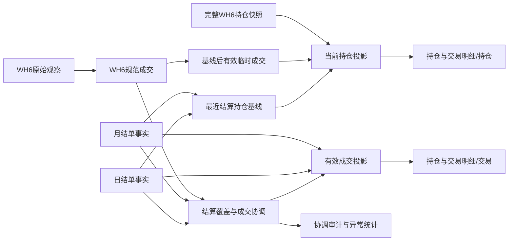

# WH6 采集事实、结算单确认与临时持仓推算修改设计

- 版本：V1.0 冻结设计
- 日期：2026-09-06
- 文档状态：业务口径已确认，可交给新对话直接实施
- 目标模块：交易管理 / 持仓与交易明细、WH6 采集协调、Staging 错误历史清理
- 首个实施环境：Render Staging + Supabase `LTM WEB STAGING`
- Staging Supabase project id：`hzpivfwtdiqnfxbcxgrm`
- 当前已验收代码参考：`/Users/wangjingze/.codex/worktrees/81f0/轻量化交易管理系统WEB`
- 本文形成时参考 HEAD：`ffc706a`；执行时必须重新 fetch，以最新 `origin/staging` 为真实基线
- 当前文档所在 `/320f/` 工作区：detached HEAD `2e9f3b5`，只用于保存本设计，不得作为开发基线
- Production：本文不授权 `main`、Production 部署、Production 环境变量或 Production 数据变更

> 本文是本次修改的唯一冻结设计和执行依据。它补充并在冲突处覆盖 2026-09-04 的 WH6 方案 A、月结治理和采集修复文档。新对话必须先读取本文，再从最新 `origin/staging` 建立干净工作区；不得直接在 `/320f/` 的旧 detached HEAD 上开发。

## 1. 交付目标

把当前分离的两套事实入口合并为一套业务可见的“持仓与交易明细”：

1. 已生效日结单代表对应账户、对应交易日内的完整权威交易事实。
2. 已生效月结单代表对应账户、对应自然月内的完整权威交易事实。
3. 未被结算单覆盖的 WH6 成交作为临时事实进入同一成交列表。
4. 结算单到来后，其覆盖范围内只使用结算单事实；匹配和不匹配的 WH6 记录都退出有效统计。
5. 当前持仓只有一个业务入口。没有完整 WH6 持仓快照时，用最近一次结算确认持仓加后续有效 WH6 成交推算。
6. 页面用“临时 / 结算确认”区分事实状态；日结单、月结单和 WH6 作为来源细节保留。
7. 删除 Staging 中旧版本错误上传的 1,000 条历史 WH6 数据及其直接依赖，保留最小删除审计。
8. 为以后持仓预警和 Delta/Gamma 保留完整性、新鲜度和来源字段，但本次不开发预警规则或 Greeks 计算功能。

完成后，用户在“持仓与交易明细”中看到的是同一套有效事实，不需要在结算单页面和采集页面之间自行拼接。

## 2. 用户已确认的业务决定

### 2.1 结算单是完整权威来源

- 日结单覆盖其账户和交易日内的全部完整交易。
- 月结单覆盖其账户和对应月份内的全部完整交易。
- 同一覆盖范围内的来源优先级固定为：月结单 `200` > 日结单 `100` > WH6 `0`。
- WH6 与结算单无法匹配时仍以结算单为准，不能继续把未匹配 WH6 记录计入有效成交、持仓或合计。
- 结算单覆盖只影响其截止范围；截止范围以后的新 WH6 数据继续作为临时事实。

### 2.2 无持仓快照时允许推算

- 最近一次结算确认持仓是推算基线。
- 基线之后、尚未被结算单覆盖的有效 WH6 成交用于增减持仓。
- 推算结果用于接近文华当前持仓并提供更丰富的筛选能力。
- 推算持仓在主状态中显示“临时”，详情中显示“形成方式：系统推算”。
- 后续获得完整 WH6 持仓快照时，实际快照优先作为临时当前持仓，并用于校验推算结果。

### 2.3 旧版本错误上传的1,000条历史数据删除

- 这 1,000 条不是正常历史证据，而是旧版本错误上传的数据，没有业务用途。
- 允许从 Staging 的业务事实、原始观察和协调关系中物理删除。
- 为防止误删，只保留删除批次摘要、数量、条件、执行人和执行时间，不保留其完整业务内容作为正常数据。
- 这一授权仅针对本文第 11 节锁定的 Staging 候选集，不扩展到正常 WH6 记录、结算单记录或 Production 数据。

## 3. 与旧设计冲突时的覆盖关系

| 旧设计条款 | 本次冻结规则 |
| --- | --- |
| 只有月结单使 WH6 退出有效事实 | 日结单确认其交易日，月结单确认其月份；两者都使覆盖范围内 WH6 退出有效事实。只有月结单继续负责关闭整月采集范围。 |
| 高优先级空字段可从 WH6 回填 | 结算确认后的核心业务字段只取结算单体系；月结缺失时可从同一身份的日结单补充。WH6 的成交时刻、委托号和技术证据单独保留，不写进结算确认主事实。 |
| 所有 WH6 原始观察永不物理删除 | 正常数据继续保留。本文明确识别的旧版本错误 1,000 条是一次性例外，按安全清单删除。 |
| 采集页提供独立当前持仓业务表 | 业务当前持仓只保留在“持仓与交易明细”。采集页只保留设备、策略和快照健康诊断，不作为第二套业务持仓。 |

## 4. 稳定需求编号

- `TFM-001`：日结单和月结单按各自范围形成完整权威覆盖。
- `TFM-002`：成交列表统一展示结算确认事实与未覆盖 WH6 临时事实，不重复计数。
- `TFM-003`：底层保留 `daily / monthly / wh6`，页面主状态只显示“临时 / 结算确认”。
- `TFM-004`：统一 `YYYYMMDD` 与 `YYYY-MM-DD` 的匹配语义，修复日期格式导致的协调失败。
- `TFM-005`：没有完整持仓快照时，从最近结算基线和后续有效 WH6 成交推算当前持仓。
- `TFM-006`：事实状态、形成方式和数据新鲜度分开表达，所有用户可见时间只到秒。
- `TFM-007`：安全删除锁定的 Staging 错误 1,000 条及其直接依赖，不影响正确数据。
- `TFM-008`：临时成交不能进入业务归属、正式平仓盈亏、业务台账或正式导出。
- `TFM-009`：业务当前持仓只有一个入口；采集管理页降级为诊断入口。
- `TFM-010`：完成本地回归、Staging 数据回读和真实页面验收后才可称为 Staging 完成。

### 4.1 AI-SDLC 交付分类与授权边界

- Delivery：`D3`。跨结算协调、统一事实 API、当前持仓投影、前端和一次性数据清理。
- Testing：`T3`。需要单元/集成回归、真实 Staging 数据回读和登录后页面验收。
- Risk：`R3`。涉及金融事实优先级和 Staging 物理删除，但不涉及真实交易或 Production。
- Coordination：`C1`。默认一个主 Agent 顺序执行；用户未要求子 Agent，不得自动委派。
- Impact test scope：`whole_module`，集中在交易管理与 WH6 采集模块，不能扩散到订单、现货台账或其他模块重构。
- 用户已经确认本文第 2 节业务口径，并授权删除第 12 节精确识别的 Staging 错误数据。新对话中用户要求按本文开发，即构成非生产 Gate A 启动；Production 仍需独立 Gate B。

## 5. 当前代码与数据基线

### 5.1 当前代码结构

最新已验收 WH6 代码位于 `/81f0/`，本文形成时与 `origin/staging` 同为 `ffc706a`：

- `backend/app/trading_management.py`
  - `query_fact_rows("trades")` 只读 `trading_trade_facts`。
  - `query_fact_rows("positions")` 只读 `trading_position_snapshots`。
  - 因此“持仓与交易明细”目前只显示结算单导入事实。
- `backend/app/trading_collector_service.py`
  - WH6 成交写入 `trading_intraday_fills`。
  - WH6 完整持仓写入 `trading_intraday_position_snapshots/rows`。
  - 当前持仓接口只接受完整 WH6 快照，没有快照时返回不可用。
- `backend/app/trading_collector_reconciliation.py`
  - 已具备日结/月结/WH6 匹配、字段来源和追加协调审计。
  - `_settlement_rows_for_date()` 当前用 `tf.trade_date = ?` 直接比较日期。
  - `match_intraday_fill()` 先把 WH6 日期规范为 `YYYY-MM-DD`，导致与结算事实的 `YYYYMMDD` 无法等值匹配。
  - 当前 `settlement_covered` 主要按完整月结覆盖处理，尚未把日结单明确作为当天完整覆盖。
- `frontend/trading_management.js`
  - “持仓与交易明细”已有持仓、平仓、交易三个页签、筛选、分页和业务归属选择。
  - 还没有事实状态字段或状态筛选。
- `frontend/trading_collector.js`
  - 采集管理页另有“最新盘中成交”和“当前期权持仓（完整快照）”，容易形成第二套业务入口。

### 5.2 2026-09-06 Staging 只读快照

以下是设计形成时的只读证据，不得硬编码为永久业务常量；实施前必须重新查询：

| 项目 | 当前结果 |
| --- | ---: |
| 结算成交事实日期为 `YYYYMMDD` | 33,471 条 |
| 结算成交事实日期为 ISO | 0 条 |
| WH6 成交日期为 ISO | 1,362 条 |
| WH6 成交日期为 `YYYYMMDD` | 0 条 |
| 正常临时 WH6 成交 | 362 条，ID 1001—1362，交易日 2026-09-01—2026-09-07 |
| 错误历史 WH6 成交 | 1,000 条，ID 1—1000，交易日 2026-06-16—2026-08-12 |
| 错误历史原始观察 | 1,000 条 |
| 错误历史协调记录 | 1,000 条 |
| 与错误历史直接关联的问题记录 | 0 条 |
| WH6 持仓观察 / 快照 / 行 | 0 / 0 / 0 |

错误 1,000 条当前共同特征：

- `account_id = 1`，对应宏源期货账户；
- `data_status = 'settlement_conflict'`；
- `reconciliation_status = 'monthly_unmatched'`；
- ID 连续为 1—1000；
- `parser_version = 'wh6-match-v1'`；
- 来自设备 `device_id = 1` 的 1,000 条观察；
- 69 个不同来源路径、1,000 个不同规范事件键；
- 首次接收时间范围为 2026-09-03 14:20:01—2026-09-04 14:00:09（北京时间，展示到秒）。

如果实施时任一特征发生变化，清理脚本必须停止，不得扩大条件凑满 1,000 条。

## 6. 范围与非目标

### 6.1 本次必须完成

- 修复结算事实和 WH6 日期格式不一致导致的匹配失败。
- 让日结单确认当天、月结单确认整月，覆盖范围内只保留结算单为有效事实。
- 在现有“持仓与交易明细”合并结算确认成交与临时 WH6 成交。
- 在同一当前持仓列表合并结算持仓、实际 WH6 快照或推算持仓。
- 增加“临时 / 结算确认”字段和筛选。
- 保留来源类型、形成方式、数据截至时间和新鲜度。
- 删除锁定的 Staging 错误 1,000 条及其 1,000 条观察、1,000 条协调记录。
- 完成本地测试、Staging 部署、数据库回读和真实页面验收。

### 6.2 本次明确不做

- 不修改 `main`，不部署 Production，不修改 Production 数据或环境变量。
- 不重建或重新发布 WH6 0.3.2 EXE，除非实施证据证明服务端合同改变导致现有 EXE 无法继续上传；出现该情况应停止并返回设计评估。
- 不开发持仓预警规则、通知、Delta/Gamma 计算或新的行情接入。
- 不让临时 WH6 成交进入上海钧能台账、期权业务台账、交易总览业务口径或正式导出。
- 不给临时开仓设置业务归属；业务归属仍只作用于结算确认的 `trading_fact_identities`。
- 不把临时成交写成 `trading_trade_facts`，不复制成伪结算事实。
- 不根据 WH6 推断正式平仓盈亏、手续费结算、权利金收支、行权、履约或到期放弃。
- 不删除 362 条及其后新增的正常临时数据，不删除任何结算单批次或结算事实。
- 不执行下单、撤单、改单、平仓、行权、资金操作、进程注入、内存读取、抓包或 WH6 界面控制。

## 7. 状态与来源模型

### 7.1 页面主状态

页面只使用两个事实状态：

| API 值 | 页面文字 | 含义 |
| --- | --- | --- |
| `provisional` | 临时 | 尚未被覆盖范围内的日结/月结确认，来源可为 WH6 实采或系统推算。 |
| `settlement_confirmed` | 结算确认 | 当前有效值来自已生效日结单或月结单。 |

“异常”不是第三种事实状态，而是独立的核对状态。被结算单覆盖但无法匹配的 WH6 记录不会出现在有效事实列表，只进入诊断统计和审计。

### 7.2 来源类型

| API 值 | 页面详情 | 优先级 |
| --- | --- | ---: |
| `monthly` | 月结单 | 200 |
| `daily` | 日结单 | 100 |
| `wh6` | WH6采集 | 0 |

主表可只显示“临时 / 结算确认”；来源类型在状态旁或详情抽屉显示。底层始终保留具体来源。

### 7.3 持仓形成方式

| API 值 | 页面文字 | 事实状态 |
| --- | --- | --- |
| `settlement_snapshot` | 结算单持仓 | 结算确认 |
| `wh6_snapshot` | WH6完整快照 | 临时 |
| `inferred_from_settlement_and_fills` | 系统推算 | 临时，未受临时成交影响的基线行可保持结算确认 |

### 7.4 新鲜度状态

| API 值 | 含义 |
| --- | --- |
| `current` | 至少一个绑定设备的最近心跳不超过现有 30 秒阈值，且无持久快照冲突。 |
| `stale` | 可以展示最后结果，但设备心跳或快照已经超过阈值。 |
| `conflict` | 多设备完整持仓快照持续不一致。 |
| `unavailable` | 缺少可验证结算基线，或推算出现负持仓等守恒错误。 |

事实状态回答“有没有被结算确认”，新鲜度回答“现在是否仍接近实时”。二者不得合并成一个字段。

## 8. 总体架构



核心原则：不把不同来源物理塞进同一事实表，而是在服务层生成唯一“有效事实投影”。这样结算单到来后只需更新协调状态，页面自然切换来源，不会复制或重复计数。

## 9. 日期标准化与结算覆盖

### 9.1 日期函数

在 `backend/app/trading_collector_reconciliation.py` 把现有私有日期解析整理成以下公共合同：

```python
def normalize_trade_date(value: object) -> date | None:
    """Accept YYYYMMDD or YYYY-MM-DD and return a calendar date."""

def iso_trade_date(value: object) -> str:
    """Return YYYY-MM-DD or an empty string for invalid input."""

def compact_trade_date(value: object) -> str:
    """Return YYYYMMDD or an empty string for invalid input."""

def trade_date_variants(value: object) -> tuple[str, str]:
    """Return (YYYY-MM-DD, YYYYMMDD); invalid input raises ValueError."""
```

本次不批量重写已有 33,471 条结算事实日期，也不增加规范日期列。所有匹配和跨来源查询必须通过上述函数生成等价日期，减少迁移风险并保持现有 API 的 `YYYYMMDD` 兼容。

### 9.2 覆盖范围

新增只读函数：

```python
def get_active_statement_coverages(cur, account_id: int) -> list[dict[str, object]]:
    """Return normalized active daily and complete-monthly authority ranges."""

def statement_coverage_for_date(
    cur,
    account_id: int,
    trade_date: object,
    *,
    lookup_cache: ReconciliationLookupCache | None = None,
) -> dict[str, object] | None:
    """Return the highest-priority active coverage for one trading date."""
```

覆盖资格：

- 日结单：`status='active'`、`statement_type='daily'`、起止日期规范化后是同一天。
- 月结单：`status='active'`、`statement_type='monthly'`、起止日期完整覆盖同一自然月。
- 同一天同时被月结和日结覆盖时返回月结。
- `preview`、`superseded`、解析失败和不完整月结不形成覆盖。

设备采集策略中的 `closed_ranges` 继续只包含完整月结单。日结单确认当天事实，但不关闭整月采集，也不改变 `history_start_date`。

### 9.3 修复匹配查询

`_settlement_rows_for_date()` 不再使用单值 `tf.trade_date = ?`，而是用两种等价日期：

```sql
AND tf.trade_date IN (?, ?)
```

参数固定为 `YYYY-MM-DD` 和 `YYYYMMDD`。同时保留账户、active 批次、日/月类型和 `is_current=1` 条件。

### 9.4 协调结果

状态扩展为：

| 状态 | 处理 |
| --- | --- |
| `unmatched` | 当天没有有效结算覆盖，WH6 保持临时有效。 |
| `matched_daily` / `corrected_daily` | 日结覆盖当天；有效事实使用日结，WH6 退出有效投影。 |
| `daily_unmatched` | 日结覆盖当天但没有唯一 WH6 对应；WH6 退出有效投影并记录核对异常。 |
| `matched_monthly` / `corrected_monthly` | 月结覆盖月份；有效事实使用月结。 |
| `monthly_unmatched` | 月结覆盖月份但没有唯一对应；WH6 退出有效投影并记录核对异常。 |
| `ambiguous` | 存在多个候选。若当天有结算覆盖则退出有效投影；没有覆盖则保持临时但标记不可自动确认。 |

`trading_intraday_fills.data_status` 统一解释：

- `provisional`：没有结算覆盖，可进入有效成交投影。
- `settlement_covered`：已由日结或月结接管，不再进入 WH6 有效投影。
- `settlement_conflict`：处于结算覆盖范围但未唯一匹配，不进入有效投影。

结算导入成功后，在同一事务内协调其覆盖日期；新 WH6 成交入库后立即按当前结算覆盖协调。有效查询还要使用覆盖范围做防御性排除，避免导入与协调短暂竞态造成重复显示。

### 9.5 字段来源规则

结算确认后的主事实字段：

- 交易所、合约、资产类型、买卖、开平、数量、成交价；
- 成交额、手续费、投保属性、权利金收支；
- 正式平仓盈亏和其他结算事实。

这些字段只在结算单体系中取值：月结优先，月结对应字段为空时可以从同一身份的日结事实补充；不得从 WH6 静默补入结算确认主事实。

WH6 独有信息继续留在采集层：

- 成交时分秒和完整时间戳；
- 委托号；
- 原始合约、来源摘要、记录序号、记录哈希和解析器版本；
- 从合约解析出的期权类型、标的、到期月和行权价。

主列表不显示秒级时间。临时成交详情可以显示采集成交时间；结算确认详情不把 WH6 时间伪装成结算单字段。

## 10. 有效成交投影

### 10.1 新模块

新建 `backend/app/trading_effective_facts.py`，只负责跨来源的只读投影和持仓推算，不负责导入、采集鉴权或业务归属。

建议接口：

```python
@dataclass(frozen=True)
class EffectiveFactFilters:
    contract: str = ""
    direction: str = ""
    asset_type: str = ""
    open_close: str = ""
    classification: str = ""
    fact_status: str = ""
    start_date: str = ""
    end_date: str = ""
    page: int = 1
    page_size: int = 20


def query_effective_trades(cur, filters: EffectiveFactFilters) -> dict[str, object]:
    """Return one paged, deduplicated projection of settlement and provisional WH6 trades."""


def query_effective_positions(
    cur,
    filters: EffectiveFactFilters,
    *,
    now: datetime | None = None,
) -> dict[str, object]:
    """Return one current/historical position projection with row-level fact status."""
```

`trading_management.query_fact_rows()` 只负责把现有 `FactFilters` 转成 `EffectiveFactFilters` 并调用新模块，避免继续扩大现有大文件中的查询复杂度。

### 10.2 成交来源集合

有效成交由两个集合 `UNION ALL`：

1. 结算集合：
   - `trading_trade_facts.is_current = 1`；
   - 批次 `status = 'active'`；
   - 批次类型为 `daily` 或 `monthly`；
   - `fact_status='settlement_confirmed'`；
   - `source_type` 来自批次类型。
2. WH6 集合：
   - `trading_intraday_fills.data_status = 'provisional'`；
   - 没有被有效日结/月结覆盖；
   - `fact_status='provisional'`；
   - `source_type='wh6'`。

任何 `settlement_covered`、`settlement_conflict`、锁定错误批次或已由结算覆盖的 WH6 数据都不得进入集合。

### 10.3 统一成交响应

每条成交至少返回：

```json
{
  "record_key": "settlement:123",
  "identity_id": 456,
  "trade_date": "20260906",
  "trade_time": null,
  "exchange": "DCE",
  "contract": "i2701-c-800",
  "asset_type": "option",
  "side": "买",
  "open_close": "开仓",
  "quantity": 2,
  "price": 12.5,
  "turnover": 2500,
  "fee": 4,
  "fact_close_pnl": null,
  "fact_status": "settlement_confirmed",
  "source_type": "daily",
  "source_label": "日结单",
  "reconciliation_status": null,
  "can_classify": true,
  "assignment_status": "unclassified"
}
```

临时 WH6 行使用 `record_key='wh6:<id>'`、`identity_id=null`、`can_classify=false`。其正式平仓盈亏、成交额、权利金等结算字段没有可靠值时返回 `null`，不填零。

### 10.4 筛选、分页和合计

- 保留现有合约、资产、方向、开平、日期和归类筛选。
- 新增 `fact_status`：空值、`provisional`、`settlement_confirmed`。
- “已归类 / 未归类”只筛选结算确认事实；临时 WH6 不属于业务层，不得被算成“未归类”。
- 服务端对合并集合完成筛选、总数、合计和分页，不能分别分页后在前端拼接。
- 排序使用规范成交日倒序、采集成交时间倒序、来源记录 ID 倒序。结算单没有成交时间时使用来源行顺序或事实 ID，页面不承诺日内秒级排序。
- 摘要增加：`provisional_count`、`settlement_confirmed_count`、`contains_provisional`。
- 手数和记录数包含当前筛选范围内两种有效状态；缺失金额字段不按零伪造。

### 10.5 业务归属隔离

- 临时 WH6 行不显示复选框，业务归属栏显示“结算确认后可归类”。
- “选择当前页”和“选择全部筛选开仓”只能返回 `can_classify=true` 的结算确认开仓。
- 现有业务归属、开平分摊、平仓盈亏和业务台账查询不改为读取临时事实。
- 平仓页签继续只显示结算单形成的正式 `trading_close_facts`；WH6 平仓成交只在“交易”页签以临时成交展示。

## 11. 当前持仓投影与推算

### 11.1 只保留一个业务当前持仓

- “交易管理 / 持仓与交易明细 / 持仓”是唯一业务当前持仓入口。
- 采集管理页原“当前期权持仓（完整快照）”改为“最新采集持仓快照诊断”，只显示快照时间、行数、完整性、冲突和新鲜度；不再展示第二套详细业务持仓表。
- 采集页的原始成交表可保留，但标题改为“采集原始成交（诊断）”，明确不等同于有效交易明细。

### 11.2 最近结算基线

选择基线时不得用 `MAX(trading_position_snapshots.snapshot_date)` 判断，因为零持仓结算单可能没有持仓行。必须从 active 结算批次选择：

1. `position_snapshot_date` 可解析；
2. 按规范日期倒序；
3. 同一日期按 `source_priority` 倒序；
4. 再按批次 ID 倒序。

选中的批次即使 `position_count=0` 也代表一个合法的空持仓基线。基线行只取该批次中 `is_current=1` 的 `trading_position_snapshots`。

### 11.3 数据源选择顺序

对当前日期：

1. 若存在交易日在结算基线之后、`complete=true`、无持久冲突的最新 WH6 完整持仓快照，使用该快照，全部行显示“临时 / WH6完整快照”。
2. 否则使用最近结算持仓基线，加基线交易日之后的有效临时 WH6 成交推算。
3. 若没有结算基线且没有完整 WH6 快照，返回 `freshness_status='unavailable'`，不能仅从若干成交猜测账户期初持仓。
4. 与结算基线同日且已被日结/月结覆盖的 WH6 快照和成交不得再次参与推算。

本次不在完整 WH6 快照之后继续叠加成交，因为当前快照合同没有明确的“已包含到哪个成交序号”水位。需要该能力时应先扩展快照水位合同，不能依靠同秒时间猜测。

### 11.4 推算分组

内部持仓键：

```text
标准交易所 + 标准合约 + 资产类型 + 持仓方向
```

页面可继续按合约、方向和资产类型聚合。当前结算持仓表没有稳定保存投保标志，不能把投保标志加入跨来源主键。

方向统一使用：

- `买`：多头持仓；
- `卖`：空头持仓。

### 11.5 成交对持仓的确定性影响

| WH6 成交 | 持仓变化 |
| --- | --- |
| 买 + 开仓 | 增加多头 |
| 卖 + 开仓 | 增加空头 |
| 卖 + 平仓 | 减少多头 |
| 买 + 平仓 | 减少空头 |

新开仓均价：

```text
新均价 = (原数量 × 原均价 + 新开数量 × 成交价) ÷ (原数量 + 新开数量)
```

平仓不改变剩余持仓均价；数量归零时移除该行。成交按规范交易日、采集成交时间、记录 ID 正序重放。秒级时间只用于内部稳定重放和临时详情，不成为结算权威字段。

### 11.6 行级状态

- 未受基线后成交影响的结算基线行：`settlement_confirmed`。
- 被至少一笔临时成交增加或减少的基线行：`provisional`，形成方式 `inferred_from_settlement_and_fills`。
- 由临时开仓新形成的行：`provisional`。
- WH6 完整快照中的所有行：`provisional`，形成方式 `wh6_snapshot`。

这样同一个当前持仓列表可以同时存在“结算确认”和“临时”行，符合用户确认的展示规则。

### 11.7 推算边界

- 推算只负责结构性持仓数量和临时持仓均价。
- 被临时成交改变的行，保证金、结算价、浮动盈亏返回 `null` 并显示横杠，不能沿用旧结算值伪装当前值。
- 若存在任何一笔平仓使目标方向数量小于零，整次推算标记 `projection_error`，返回最近结算基线和明确警告，不把负数截成零。
- 若合约、买卖、开平、数量或价格缺失，停止使用该笔成交推算并把整体标记为异常；风险资格为 false。
- 行权、履约、到期放弃和非成交调整只以结算单为准；推算阶段不猜测。
- 推算持仓不直接进入正式业务归属和正式盈亏。

### 11.8 新鲜度与未来风险接口

持仓响应至少包含：

```json
{
  "baseline_snapshot_date": "20260831",
  "as_of_time": "2026-09-06T14:35:20+08:00",
  "formation_method": "inferred_from_settlement_and_fills",
  "fact_status": "provisional",
  "freshness_status": "current",
  "collector_last_seen_at": "2026-09-06T14:35:18+08:00",
  "age_seconds": 2,
  "risk_eligible": false,
  "warnings": []
}
```

- 时间统一截断到秒，不返回毫秒、微秒或小数秒。
- 推算持仓本次固定 `risk_eligible=false`；该字段仅为以后预警和 Greeks 留接口，不在本次触发任何预警。
- 完整且新鲜的 WH6 快照以后可以通过单独确认改为风险可用，本次不改变风险业务规则。
- 没有成交并不代表采集停止；新鲜度必须使用设备心跳或完整快照时间，不能只看最后一笔成交时间。

### 11.9 持仓响应字段

每行至少返回：

```json
{
  "position_key": "DCE:i2701-c-800:option:买",
  "snapshot_date": "20260906",
  "contract": "i2701-c-800",
  "asset_type": "option",
  "direction": "买",
  "quantity": 2,
  "average_price": 12.5,
  "margin": null,
  "fact_status": "provisional",
  "source_type": "wh6",
  "formation_method": "inferred_from_settlement_and_fills",
  "assignment_status": "not_applicable"
}
```

结算确认行继续保留现有业务归属展示。临时行的业务归属显示“结算确认后可归类”。

## 12. Staging 错误1,000条安全清理

### 12.1 新建一次性安全脚本

新建：

```text
scripts/cleanup_wh6_erroneous_history.py
tests/test_cleanup_wh6_erroneous_history.py
```

命令合同：

```bash
python3 scripts/cleanup_wh6_erroneous_history.py \
  --environment staging \
  --account-code hongyuan_futures \
  --expected-count 1000

python3 scripts/cleanup_wh6_erroneous_history.py \
  --environment staging \
  --account-code hongyuan_futures \
  --expected-count 1000 \
  --apply
```

- 默认 dry-run，事务最终回滚。
- 脚本只接受 `staging`；不得提供 Production apply 绕过参数。
- 不打印数据库 URL、令牌、完整来源路径或原始业务内容。
- 第二次执行时，如果候选已经为零且存在本次清理审计，返回 `already_clean`，不报伪失败。

### 12.2 候选集必须同时满足

```sql
account_id = 宏源期货账户ID
AND id BETWEEN 1 AND 1000
AND data_status = 'settlement_conflict'
AND reconciliation_status = 'monthly_unmatched'
AND trade_date BETWEEN '2026-06-16' AND '2026-08-12'
AND parser_version = 'wh6-match-v1'
```

应用前必须再次验证：

- 成交 1,000 条；
- 最小/最大 ID 为 1/1000；
- 规范事件键 1,000 个且无重复；
- 原始观察 1,000 条，全部来自设备 1；
- 当前协调记录及历史协调记录合计 1,000 条；
- 关联问题记录为 0；
- 候选中没有 ID 大于 1000；
- ID 1001 及以上的正常临时数据不满足候选条件。

任何一项不一致都必须停止并输出安全摘要，不得放宽日期、ID或状态条件。

### 12.3 删除顺序

在一个数据库事务内：

1. 把候选 ID 和事件键写入事务内临时表。
2. 删除候选对应的 `trading_intraday_fill_reconciliations`。
3. 按账户和 `source_event_key` 删除候选对应的 `trading_intraday_fill_observations`。
4. 再次确认 `trading_collector_issues` 为 0；若不为 0，停止而不是自动删除问题记录。
5. 删除候选 `trading_intraday_fills`。
6. 向 `operation_logs` 写一条最小审计：模块、实体类型、执行人、候选条件摘要、删除前后数量、备份 schema 名称和执行时间。
7. 验证守恒后提交。

`trading_intraday_fill_reconciliations.intraday_fill_id` 是 `NO ACTION` 外键，因此协调记录必须先删。

### 12.4 备份与回滚

执行 apply 前，在 Staging 私有 schema 创建精确候选备份，例如：

```text
codex_backup_20260906_wh6_erroneous_history
```

只备份三个候选集合及一张 manifest：

- 错误 `trading_intraday_fills`；
- 对应 `trading_intraday_fill_observations`；
- 对应 `trading_intraday_fill_reconciliations`；
- manifest 记录表名、行数、ID范围、日期范围和内容摘要哈希。

逐表回读 1000/1000/1000 后才能删除。备份不被应用查询，保留为 Staging 验收期间的回滚点；本次任务不删除该私有备份。

回滚顺序：恢复 fills，再恢复 observations，最后恢复 reconciliations；恢复前先确认没有新记录占用相同唯一键。回滚只针对 Staging，不能覆盖清理后的新正常采集数据。

### 12.5 清理后验证

- 锁定候选查询返回 0。
- 旧 ID 1—1000 不再存在于三张业务表。
- ID 1001 及以后的正确数据仍存在；不能把“仍为362条”写成永久断言，因为采集会继续增长。
- 设备、连接码、账户策略、结算批次、结算事实和持仓表数量不变。
- 采集器下一次心跳和上传后，6—8月错误记录不重新出现。
- 页面不再显示或统计这 1,000 条。

## 13. API 与页面修改

### 13.1 现有接口直接升级

保留现有入口：

```text
GET /api/trading-management/facts/trades
GET /api/trading-management/facts/positions
GET /api/trading-management/facts/closes
```

`trades` 和 `positions` 增加可选参数：

```text
fact_status = "" | "provisional" | "settlement_confirmed"
```

保持旧调用兼容；不传时返回两种有效状态。`closes` 仍只返回结算确认事实。

### 13.2 页面表格

交易页新增：

- “事实状态”列；
- “数据来源”列或状态详情；
- “全部状态 / 临时 / 结算确认”筛选。

持仓页新增：

- “事实状态”列；
- “形成方式”列；
- 顶部数据截至时间和新鲜度提示；
- “全部状态 / 临时 / 结算确认”筛选。

状态文案固定：

- `provisional` -> “临时”；
- `settlement_confirmed` -> “结算确认”；
- `daily` -> “日结单”；
- `monthly` -> “月结单”；
- `wh6_snapshot` -> “WH6完整快照”；
- `inferred_from_settlement_and_fills` -> “系统推算”。

### 13.3 用户可见时间

- 页面、API状态时间、设备时间、快照时间、截至时间和 `age_seconds` 均只到秒。
- 底层数据库可以保留更高精度审计时间，但响应序列化时必须截断。
- 主交易表仍按天展示，不新增秒级成交列。

### 13.4 诊断页

- 采集管理页继续提供设备、策略、原始成交和协调按钮。
- 原“当前期权持仓（完整快照）”改成健康摘要；没有快照时明确显示“尚未收到完整持仓快照，业务当前持仓使用结算基线推算”。
- 原始成交表标题增加“诊断”，避免与统一交易明细混淆。
- 诊断页只对既有权限开放，不新增权限。

## 14. 文件结构与职责

### 14.1 新建文件

- `backend/app/trading_effective_facts.py`：有效成交投影、结算持仓基线选择、WH6 快照选择、临时持仓推算和新鲜度。
- `scripts/cleanup_wh6_erroneous_history.py`：Staging 错误1,000条 dry-run/apply 清理。
- `tests/test_trading_effective_facts.py`：跨来源成交和持仓投影的确定性测试。
- `tests/test_cleanup_wh6_erroneous_history.py`：候选保护、删除顺序、幂等和 Production 拒绝测试。

### 14.2 修改文件

- `backend/app/trading_collector_reconciliation.py`
  - 日期公共函数；
  - active 日结/月结覆盖；
  - `daily_unmatched`；
  - 日结覆盖后的 `settlement_covered/conflict`；
  - 结算字段与 WH6 审计字段边界。
- `backend/app/trading_collector_service.py`
  - 新成交入库后的覆盖协调；
  - 诊断响应时间截断到秒；
  - 采集页快照健康摘要。
- `backend/app/trading_management.py`
  - `FactFilters.fact_status`；
  - 交易、持仓调用有效事实模块；
  - 业务归属选择排除临时事实；
  - API 参数校验和响应兼容。
- `backend/app/trading_collector.py`
  - 如诊断响应合同需要，调整只读路由返回；不增加交易写入能力。
- `frontend/trading_management.js`
  - 状态筛选、状态列、形成方式、新鲜度、临时事实不可归属。
- `frontend/trading_management.css`
  - 复用现有 tag 样式，增加必要的临时/过期状态样式。
- `frontend/trading_collector.js`
  - 诊断标题和快照健康摘要，不再渲染第二套详细业务持仓。
- `frontend/index.html`
  - 调整采集页文案并升级静态资源版本。
- `tests/test_trading_collector_reconciliation.py`
  - 日期等价、日结完整覆盖、月结覆盖和异常排除。
- `tests/test_trading_management.py`
  - 统一事实 API、筛选、分页、归属隔离和现有结算回归。
- `tests/test_trading_collector_service.py`
  - 入库即协调、时间精度和诊断摘要。
- `tests/trading_management_frontend.test.mjs`
  - 状态列、筛选、不可归属和一套当前持仓。
- `tests/trading_collector_frontend.test.mjs`
  - 诊断页不再形成第二套业务持仓。
- `README.md`
  - Staging 验收后记录统一事实和推算持仓行为。
- `版本更新记录.md`
  - 仅在真实 Staging 部署、清理和页面验收完成后更新。
- `项目交接摘要.md`
  - 仅当任务需要跨对话继续或形成新的阻塞时更新；仓库没有该文件则不为本功能新建。

### 14.3 数据库结构

本设计不要求新增业务表或日期列。现有表和 `operation_logs` 足以完成投影、协调与清理审计。若实现者认为必须新增数据库列或表，必须先返回设计评估，说明现有服务层投影为何无法满足需求，不得直接扩大迁移范围。

## 15. 实施任务清单

### Task 0：建立干净执行基线

- [ ] 读取项目 `AGENTS.md`、`README.md`、`开发流程_备忘.md`、`版本更新记录.md` 和本文。
- [ ] 使用 `superpowers:using-git-worktrees`，从最新 fetched `origin/staging` 建立独立 worktree/分支。
- [ ] 建议分支：`codex/trading-effective-facts-20260906`。
- [ ] 记录 `origin/staging`、`origin/main`、新 worktree HEAD 和 `git status`。
- [ ] 从本文绝对路径把设计文档原样复制进新 worktree 的同一相对路径并用 `cmp` 验证。
- [ ] 检查基线已有 WH6 0.3.2 代码；若最新 Staging 不包含 `ffc706a` 的等价能力，停止并先说明缺失提交。
- [ ] 跑当前 WH6/交易管理定向基线测试，记录既有失败；没有基线通过不得进入行为修改。

基线命令：

```bash
git fetch origin
git rev-parse origin/staging origin/main
git status --short --branch

env -u DATABASE_URL .venv/bin/python -m pytest -q \
  tests/test_trading_collector_reconciliation.py \
  tests/test_trading_collector_service.py \
  tests/test_trading_collector_api.py \
  tests/test_trading_collector_positions_service.py \
  tests/test_trading_collector_positions_api.py \
  tests/test_trading_management.py

node --test \
  tests/trading_management_frontend.test.mjs \
  tests/trading_collector_frontend.test.mjs
```

### Task 1：先用失败测试锁定日期和覆盖规则

- [ ] 在 `tests/test_trading_collector_reconciliation.py` 增加 `YYYYMMDD` 结算与 ISO WH6 能唯一匹配的失败测试。
- [ ] 增加日结当天匹配后 `data_status='settlement_covered'` 的失败测试。
- [ ] 增加日结当天无候选时 `daily_unmatched + settlement_conflict` 的失败测试。
- [ ] 增加月结和日结同时覆盖时月结获胜的测试。
- [ ] 增加无结算覆盖时 WH6 继续 provisional 的测试。
- [ ] 增加日结不进入采集 `closed_ranges` 的回归测试。
- [ ] 运行定向测试确认新增断言先失败。
- [ ] 实现第 9 节公共日期和覆盖函数、扩展状态与缓存。
- [ ] 修改 `_settlement_rows_for_date()` 使用两种日期值。
- [ ] 修改 `_persist_resolution()`，让日结和月结覆盖都能使 WH6 退出有效事实。
- [ ] 修改字段解析，结算确认后的核心字段不再从 WH6 回填。
- [ ] 运行协调和结算导入测试直至通过。
- [ ] 单独提交这一任务。

建议提交信息：

```text
fix: treat daily and monthly statements as authoritative coverage
```

### Task 2：实现统一有效成交投影

- [ ] 新建 `tests/test_trading_effective_facts.py`，先覆盖第 10 节所有集合、状态、筛选和分页场景。
- [ ] 测试同日有日结时只返回一条结算确认成交，不返回对应或未对应 WH6。
- [ ] 测试月结替代同月日结且不重复。
- [ ] 测试没有结算覆盖时返回 WH6 临时成交。
- [ ] 测试分类筛选和批量选择永不返回临时记录。
- [ ] 测试缺失金额返回 `null` 而不是零。
- [ ] 新建 `trading_effective_facts.py` 并实现服务端合并、合计和分页。
- [ ] 修改 `FactFilters` 和现有 `/facts/trades` 路由接入新模块。
- [ ] 保持 `/facts/closes` 原行为不变。
- [ ] 运行交易管理、协调和新模块测试。
- [ ] 单独提交这一任务。

建议提交信息：

```text
feat: unify settlement and provisional trade facts
```

### Task 3：实现当前持仓推算

- [ ] 先写“结算基线＋买开/卖开/卖平/买平”的失败测试。
- [ ] 写加权均价、平仓均价不变、数量归零删除行的测试。
- [ ] 写零持仓结算批次可作为合法空基线的测试。
- [ ] 写没有基线时 unavailable 的测试。
- [ ] 写平仓超过持仓时 projection_error、不截零的测试。
- [ ] 写未受临时成交影响行保持结算确认、受影响行变临时的测试。
- [ ] 写完整 WH6 快照晚于结算基线时选择快照的测试。
- [ ] 写持久快照冲突和设备心跳过期的新鲜度测试。
- [ ] 在 `trading_effective_facts.py` 实现第 11 节算法。
- [ ] 修改 `/facts/positions` 使用统一投影；保持历史明确日期的结算快照查询兼容。
- [ ] 确保推算响应时间全部截断到秒。
- [ ] 运行持仓、估值和交易管理回归测试。
- [ ] 单独提交这一任务。

建议提交信息：

```text
feat: infer provisional positions from confirmed baseline
```

### Task 4：合并业务页面并保留诊断入口

- [ ] 先更新 Node 契约测试，锁定状态筛选、状态列、临时不可归属和唯一业务当前持仓。
- [ ] 在 `trading_management.js` 增加状态筛选和 DTO 文案映射。
- [ ] 修改成交和持仓表格列、详情和顶部新鲜度提示。
- [ ] 临时成交不渲染选择框；批量选择只加入 `can_classify=true` 行。
- [ ] 修改采集管理页标题和持仓诊断，不再渲染第二套详细业务持仓。
- [ ] 更新 CSS 和 `index.html` 静态资源版本。
- [ ] 检查桌面和 390×844 移动视图没有横向破坏。
- [ ] 运行 Node 定向测试和 JavaScript 语法检查。
- [ ] 单独提交这一任务。

建议提交信息：

```text
feat: show one status-aware position and trade view
```

### Task 5：实现错误历史安全清理脚本

- [ ] 先写 dry-run 不落库测试。
- [ ] 写候选数量、ID、日期、解析器或依赖数量任一不符就停止的测试。
- [ ] 写 apply 按协调记录、观察、成交顺序删除并写最小 operation log 的测试。
- [ ] 写第二次 apply 返回 already_clean 的测试。
- [ ] 写 Production 参数无法执行的测试。
- [ ] 写正确 ID 1001 及以后的数据保持不变的测试。
- [ ] 实现脚本，不在普通 Web API 增加删除入口。
- [ ] 在本地 SQLite fixture 上完成 dry-run/apply/重复 apply。
- [ ] 单独提交这一任务。

建议提交信息：

```text
chore: add guarded staging cleanup for invalid WH6 history
```

### Task 6：完整本地质量门禁

- [ ] 运行所有本次相关 Python 测试。
- [ ] 运行所有本次相关 Node 测试。
- [ ] 运行完整 Python 和 Node 回归；若仓库已有无关失败，记录基线对比并证明本次没有新增失败。
- [ ] 运行 Python 编译、JavaScript 语法和 `git diff --check`。
- [ ] 检查 diff 只触及第 14 节文件。
- [ ] 检查没有秘密、数据库 URL、账号、密码、令牌或原始来源路径进入代码、日志和文档。
- [ ] 检查没有真实交易写能力。

定向命令：

```bash
env -u DATABASE_URL .venv/bin/python -m pytest -q \
  tests/test_trading_effective_facts.py \
  tests/test_trading_collector_reconciliation.py \
  tests/test_trading_collector_service.py \
  tests/test_trading_collector_api.py \
  tests/test_trading_collector_positions_service.py \
  tests/test_trading_collector_positions_api.py \
  tests/test_trading_management.py \
  tests/test_cleanup_wh6_erroneous_history.py \
  tests/test_reconcile_wh6_intraday_script.py

node --test \
  tests/trading_management_frontend.test.mjs \
  tests/trading_collector_frontend.test.mjs

.venv/bin/python -m compileall -q backend collector scripts
node --check frontend/trading_management.js
node --check frontend/trading_collector.js
git diff --check
```

### Task 7：Staging 部署和数据清理

- [ ] 记录候选 commit 和部署前 `origin/staging`。
- [ ] 按项目流程推送 Staging，等待 Render 实际切换到候选 commit。
- [ ] 在 Staging 只读运行错误历史清理 dry-run，验证第 12.2 节全部条件。
- [ ] 创建私有候选备份 schema 并逐表回读 1000/1000/1000。
- [ ] 再运行一次 dry-run，确认备份期间候选没有漂移。
- [ ] 显式 `--apply` 删除锁定候选。
- [ ] 回读候选为 0、正确临时数据仍在、结算事实和设备不变。
- [ ] 让真实采集器完成至少一次新心跳/上传后再次回读，确认错误历史没有恢复。
- [ ] 不在 Staging 中制造模拟成交或模拟持仓。

### Task 8：真实页面验收和交接

- [ ] 用内置浏览器打开 `https://ltm-web-staging.onrender.com/?codex=<candidate-commit>`。
- [ ] 核对 URL、页面标题、静态资源版本和控制台。
- [ ] 使用既有 Staging 管理员登录路径进入“持仓与交易明细”。
- [ ] 在交易页确认结算确认和临时标签、状态筛选、分页和详情。
- [ ] 确认临时开仓没有业务归属复选框；结算确认开仓仍可按现有流程归属。
- [ ] 在持仓页确认只有一套当前持仓、结算基线、临时推算行、形成方式和数据截至时间。
- [ ] 在采集管理页确认持仓只作为快照诊断，不再形成第二套业务列表。
- [ ] 按数据库查询逐项勾稽页面记录数和手数；页面合计与同筛选条件 API 一致。
- [ ] 若有条件读取目标 Windows 上的文华当前持仓，仅做人工只读数量对照；无法取得时明确记录“未完成文华画面对照”，不得把 API 自洽当成文华一致性验收。
- [ ] 更新 README 和版本更新记录，记录部署 commit、数据清理数量、备份 schema、页面证据和回滚点。
- [ ] 形成 Gate B 摘要，但不合并 main、不发布 Production。

## 16. 必须通过的验收场景

| 编号 | 场景 | 预期结果 |
| --- | --- | --- |
| A01 | 结算 `20260906`、WH6 `2026-09-06` 且成交编号一致 | 唯一匹配，不再判为 unmatched。 |
| A02 | 当天没有结算单 | WH6 出现在统一成交页，状态“临时”。 |
| A03 | 日结单到达且与 WH6 匹配 | 只显示日结成交，状态“结算确认”，WH6 不重复。 |
| A04 | 日结单到达但 WH6 找不到对应 | 仍只使用日结事实；WH6 进入 daily_unmatched 诊断，不计入合计。 |
| A05 | 月结单覆盖已有日结 | 月结成为同月当前事实，日结和 WH6 不重复。 |
| A06 | 月结单缺少秒级时间 | 主事实时间保持空；WH6 时间只留在采集审计/临时详情。 |
| A07 | 临时开仓出现在交易页 | 无业务归属复选框，不能通过批量选择接口归属。 |
| A08 | 最近结算持仓后买开 | 对应多头数量增加，均价按加权公式更新，行状态“临时”。 |
| A09 | 最近结算持仓后卖开 | 对应空头数量增加。 |
| A10 | 卖平和买平 | 分别减少多头和空头，剩余均价不变。 |
| A11 | 平仓超过已有数量 | 不截零、不显示伪当前值，返回 projection_error 和最近确认基线。 |
| A12 | 合法零持仓结算批次 | 以空基线开始推算，不回退到更早旧持仓。 |
| A13 | 无结算基线且无完整快照 | 当前持仓 unavailable，不从零猜测期初。 |
| A14 | 有更新的完整 WH6 快照 | 使用快照并显示“临时 / WH6完整快照”。 |
| A15 | 设备心跳过期 | 仍可显示最后结果，但新鲜度为 stale，用户可见时间无小数秒。 |
| A16 | 状态筛选和分页 | 服务器总数、合计、页数与结果一致，不在前端拼接。 |
| A17 | 错误历史 dry-run | 输出精确 1000/1000/1000，数据库摘要不变。 |
| A18 | 错误历史 apply | 只删除锁定候选及直接依赖，正确临时数据和结算事实不变。 |
| A19 | 清理后采集器再次上传 | 6—8月错误历史不恢复，新正常数据继续进入。 |
| A20 | 真实 Staging 页面 | 统一交易、统一持仓、状态、来源、诊断和控制台全部通过。 |

## 17. 追踪矩阵

| 需求 | 实现任务 | 主要测试/验收 |
| --- | --- | --- |
| TFM-001 | Task 1 | A01、A03、A04、A05 |
| TFM-002 | Task 2 | A02—A06、A16 |
| TFM-003 | Task 2、4 | A02、A03、A16、A20 |
| TFM-004 | Task 1 | A01 |
| TFM-005 | Task 3 | A08—A14 |
| TFM-006 | Task 3、4 | A15、A20 |
| TFM-007 | Task 5、7 | A17—A19 |
| TFM-008 | Task 2、4 | A07 |
| TFM-009 | Task 4 | A20 |
| TFM-010 | Task 6—8 | A17—A20 |

## 18. 风险、回滚与停止条件

### 18.1 主要风险

- 日期格式不统一会造成结算覆盖失效或重复显示。
- 合并查询分页不正确会让页面总数与列表不一致。
- 临时成交错误进入业务归属会污染后续业务层。
- 仅用最大持仓行日期会在零持仓结算日错误回退旧持仓。
- 推算时把买平/卖平方向处理反会形成错误持仓。
- 清理条件过宽会删除正确的 362 条及后续新数据。
- 代码回滚不能自动恢复已经删除的数据，因此清理前备份和 manifest 是独立回滚点。

### 18.2 代码回滚

- 记录部署前 `origin/staging` commit。
- 回滚代码时恢复该 commit，保留新增 operation log 和私有备份。
- 本设计不新增业务表或列，因此代码回滚不需要破坏性 schema 回滚。

### 18.3 数据回滚

- 只从本次私有候选备份恢复被删的三类记录。
- 恢复前重新核对同事件键没有被新采集占用。
- 恢复顺序遵循 fills -> observations -> reconciliations。
- 不覆盖清理后新增的正常采集记录。

### 18.4 必须停止并返回主设计判断的情况

- 最新 `origin/staging` 不包含 0.3.2 已验收功能，或存在无法解释的大范围冲突。
- 实施需要修改 WH6 EXE、验证码路由、账户绑定或采集策略合同。
- 有效事实投影需要新表、破坏性迁移或重写已有结算日期。
- 错误候选不是精确 1,000 条，或依赖数量/ID/日期/解析器与本文不一致。
- 清理目标环境无法证明是 Staging，或连接可能指向 Production。
- 推算出现负持仓、缺少结算基线、未知开平语义或无法解释的数量差异。
- 需要让临时事实进入业务归属、业务台账、正式盈亏、预警或 Greeks。
- 本地测试第二次出现新的同范围失败，或真实 Staging 页面与 API/数据库无法勾稽。
- 任何步骤触及真实交易写操作。

## 19. 新对话执行指令

新对话可以直接使用下面这段提示：

```text
请完整读取并严格执行：
/Users/wangjingze/.codex/worktrees/320f/轻量化交易管理系统WEB/docs/superpowers/specs/2026-09-06-wh6-settlement-confirmed-facts-and-provisional-positions-design.md

这是已经确认的冻结设计。请先读取项目 AGENTS.md 和规定的 onboarding 文档，从最新 fetched origin/staging 建立干净独立 worktree，不要在 /320f/ 的旧 detached HEAD 上开发，也不要默认创建子 Agent。按文档 Task 0—Task 8 顺序完成测试优先开发、Staging 部署、精确备份、错误1,000条清理、数据库回读和真实页面验收。范围只到 Staging；不得修改 main、Production、Production 数据或环境变量，不得执行任何真实交易操作。如果触发文档第18.4节停止条件，立即停下并带证据返回，不得自行改需求。
```

## 20. 完成定义

只有同时满足以下条件，才可以报告“本修改已在 Staging 完成”：

1. 最新 Staging 代码包含本文全部需求，相关定向和完整回归没有新增失败。
2. 结算日期与 WH6 日期可以真实匹配，日结和月结覆盖不再重复计数。
3. “持仓与交易明细”真实页面同时显示结算确认和临时成交，并能按状态筛选。
4. 同一页面只有一个业务当前持仓，能在无快照时显示结算基线推算结果和新鲜度。
5. 临时事实无法进入业务归属和正式平仓/业务台账口径。
6. 错误候选在备份后精确删除 1,000/1,000/1,000，正常数据和结算事实保持不变。
7. 真实采集器后续心跳/上传没有让错误历史重新出现。
8. 浏览器 URL、资源版本、页面、控制台、API和数据库回读完成同一次候选验收。
9. README、版本更新记录和回滚点在部署后更新。
10. `main`、Production 和真实交易环境完全未触及。

如果缺少第 7 项 Windows 后续心跳或文华画面对照，只能分别报告“Staging 功能完成，错误数据防复发实机证据待补”或“推算逻辑通过，文华界面对照待补”，不能包装成完整业务验收。
