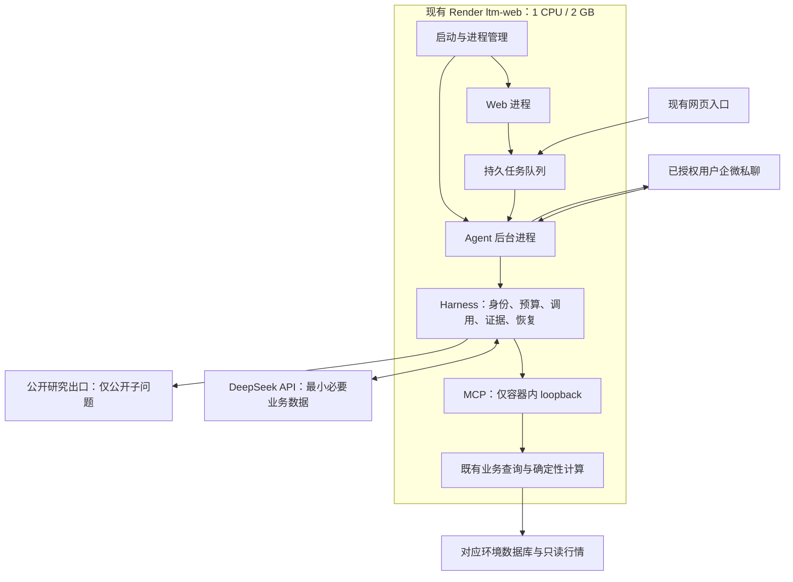

# 交易分析 Agent V2.1：复用 Render 付费实例的完整设计方案

日期：2026-09-09。状态：用户已确认采用本方案；S1–S3 的本地适配与回归已完成，共用 Render 的 Staging 迁移、真实联调、共载观察与正式发布尚未完成。

## 1. 决策与文档关系

首期复用正式系统现有 Render `ltm-web` 付费实例，在同一个服务容器内运行 Web 和独立 Agent 后台进程。DeepSeek 通过 API 提供模型能力，企微为已配对系统用户的私聊入口，MCP 连接受限业务工具。暂不新建付费 Worker、不升配、不增加实例。

访问范围修订：按用户最新要求，默认取消用户名白名单，沿用系统启用账号、Agent 权限和交易数据权限。企微每位用户首次自行绑定系统身份，无需管理员逐个添加环境变量；群共享访问另行实现。生产启用范围仍在发布时确认。

本文件是 V2.1 总体设计入口，替代旧文档中“另找常驻主机”作为默认上线路径的安排。原 [V2 业务设计](2026-09-09-trading-agent-v2-upgrade-design.md) 的范围、数据口径和通用 Eval 要求，以及 [技术合同](2026-09-09-trading-agent-v2-technical-contracts.md) 的工具 Schema、权限、持久化和模型协议继续有效；涉及部署拓扑、依赖安装、资源保护、验收顺序时以本文为准。[新版实施计划](../plans/2026-09-09-trading-agent-v2-shared-render-implementation.md) 接续原 T0–T10，不把本地测试等同于真实接入完成。

本次执行已补齐同实例启动、资源保护、任务期限、队列与企微单主锁的本地代码和测试，并更新依赖与实施文档；未修改云配置、数据库、套餐或生产服务。采用方案不等于授权正式发布。

## 2. 已核实的资源与费用基线

以下为本次会话在 2026-09-09 只读查看控制台的快照，不是持续监控或容量承诺。

| 资源 | 核实结果 | 设计含义 |
|---|---|---|
| 正式服务 ltm-web | Standard，1 CPU、2 GB，25 美元/月，1 实例，自动扩容关闭 | 首期共用目标 |
| 测试服务 ltm-web-staging | Free | 用于功能联调；不能证明全天常驻 |
| 工作区 | Hobby | 不为 Agent 自动升级工作区 |
| 正式服务近 24 小时曲线 | 近期内存约三成，CPU 多数时间较低、存在短峰 | 有试用余量，仍需共载测试 |
| 本月流量账单快照 | 8.44 GB / 5 GB，流量费 0.60 美元；预计月账单 25.60 美元 | 已有流量超额；不能宣称新增总费用为零 |

依据：[Compute](https://dashboard.render.com/web/srv-d8nus8r7uimc73a9aem0/compute)、[Metrics](https://dashboard.render.com/web/srv-d8nus8r7uimc73a9aem0/metrics)、[Billing](https://dashboard.render.com/w/tea-d8ntkd6gvqtc73e4hil0/billing)。上线前复核实际套餐、运行配置和负载，不能以仓库 render.yaml 推断套餐。

固定计算费用目标为维持现有 25 美元/月；DeepSeek、搜索、超额流量和可能的数据库用量分别核算。无已授权额度就不执行收费测试。保留供应商返回的 token 用量，费用按当时官方费率估算并标明估算；不把订阅网页产品的费用当 API 额度。新增付费服务、升配或付费额度购买需明确确认。

## 3. 业务范围与回答方式

首批仅宏源全部期货与期权的成交、有效持仓、已核验平仓盈亏、严格行情口径浮盈亏、已支持的 Greeks 和情景测算。当前风险使用全量有效未平仓持仓，包括未归类期权；结算与 WH 事实必须协调去重，已平仓记录不计当前敞口。不以先改造期权台账页面为前置。

“现在”默认最新可用，答案写实际数据与行情截至时间。无标签即未分组；未来分组按当时归属，无历史映射时不推造。调整录入界面只要保持字段语义、标识和历史规则，通常不影响 Agent；改变字段含义或历史规则则要更新工具合同和验收。

允许按开放属性灵活筛选、汇总、排序、比较，按已有工具组合回答未预设的问题。通用知识和公开研究可以回答；尚未开放的库存、订单融资、表需、发运内部数据不可读取，不能因为数据库有表就声称已接入。

风险回答可结合真实敞口与公开方法形成明确标注的推论；不编造风险阈值、承受能力或保证结论。外部新方法只作为解释依据，未经验证的公式不得自动转成执行代码。事实、计算、公开资料、推论分别标明。

## 4. 整体架构与职责

- Agent：理解问题、选择和组合工具、组织分析及表达，不自行执行金融交易或生成任意查询代码。
- Harness：管理执行身份、会话、调用预算、权限重核、失败与取消、证据约束及结果投递。
- MCP：统一工具说明和调用协议；工具复用已有业务服务，服务端执行真实权限。首版不向公网暴露 MCP。
- Eval：发布前及变更后的评估流程，验证工具、Harness 通用能力和最终答案；不是每次聊天都要额外启动一组模型。
- 数据库：业务事实只读；Agent 会话、任务、证据、配对等附表允许按合同写入。只读分析不等于整个应用零写入。

网页与企微共用后端能力，但会话隔离。独立进程利于启停和恢复，并不提供独立 CPU、内存、安全边界或独立部署：容器 OOM、主服务重启、发布仍可能同时影响两者。

## 5. 同实例运行与依赖

沿用现有 Web 启动语义；新增小型进程管理入口，启动原 Web 命令和一个 Agent worker。Web 只监听 Render 分配的公网端口，MCP 仅 `127.0.0.1:8766`，企微由 Agent 发起出站长连接。不得在每个 uvicorn worker 或业务调度器内重复启动 Agent，不导入 main.py 来启动工具层。

本地或独立 worker 环境可以分别安装 Web 和 Agent 的锁定依赖；同实例 Render 服务只有一个构建环境，因此根目录 `requirements.txt` 显式包含 Agent 的两个运行时 pin，并在此环境中验证兼容性。候选沿用 V2 Python 3.12；不得为了 Agent 静默升级 Web 框架。若实际依赖不兼容，停止部署步骤，提交最小替代方案评估，不直接更换生产镜像。

默认关闭 Agent。Web 启动失败使服务失败，由平台恢复；Agent 启动失败或 MCP 未就绪时保留 Web，Agent 状态显示不可用。Agent 异常退出采用有限退避重启，初始建议 5、15、30 秒，10 分钟内最多 3 次，超过则保持停用并记录原因，避免重启风暴。

进程管理处理 SIGTERM：停止新接单、断开企微、有限等待或中断任务、撤销执行令牌、释放锁、结束子进程；等待上限必须小于实际平台终止宽限。关闭 Agent 的独立开关可通过既有管理/运行控制实现，首期不要求新建管理页面。环境变量变更可能触发整个服务部署，不能承诺修改开关完全不重启网站。

## 6. 资源和执行保护

以下是待验证的首期工程默认值，不是平台 SLA 或已测性能：

| 项目 | 初始设计 |
|---|---|
| Agent 并发 | 全实例最多 1 个运行中的分析任务 |
| 排队 | 最多 3 个待执行任务；超出立即提示繁忙；等待超过 120 秒明确结束 |
| 单任务预算 | 90 秒，最多 8 次工具、6 次模型请求（含修复/重试）、2 次搜索 |
| 模型单次超时 | 最长 15 秒，同时受总预算约束 |
| 数据预算 | 沿用快照 20000 行/10 MB 上限、受控预览和上下文上限；超限不静默截断 |
| 内存保护 | 容器总内存达到 75% 暂停取新任务；达到 85% 或余量不足时取消 Agent 当前计算并降级；降至 65% 以下稳定 60 秒才恢复 |
| CPU 保护 | 总 CPU 连续 30 秒高于 80% 暂停取新任务，恢复采用较低阈值并结合网站延迟 |

以容器实际限额和总使用量为依据，不能用物理宿主机内存或只看 Agent RSS。阈值实施前核验可用指标；若读不到可靠指标，不声称保护已生效，保留串行限制并阻止无监控上线。

运行中的阻塞计算必须可被终止或隔离执行；只在调用前检查时间不能保证 90 秒预算。停止后不允许后台计算继续占资源或覆盖终态。数据库连接采用小连接池与有限查询超时，外部网络调用期间不持有数据库事务；明确预算须结合现有 Web 池和数据库连接限额确定。

动态保护不是硬隔离，无法保证抢在瞬时 OOM 前救回网站。共载压测必须覆盖最重的支持场景；如果仍拖慢网站，优先缩小并发、数据预算和缓存重复计算，再讨论拆分服务。

## 7. 企微单实例、幂等与恢复

首轮仅绑定系统唯一启用用户名 `wangjingze`，通过已登录网页的一次性配对码与企微真实 userid 绑定，不按昵称识别。群聊首轮关闭，未来指定群另行配置共享范围，不能任意入群即获权。

Render 发布可能出现新旧容器重叠，单机文件锁不足。企微连接前必须获得按环境和 bot 标识区分的数据库单实例锁；沿用技术合同的 PostgreSQL advisory lock，使用专用会话连接，不能经不保证会话亲和性的事务池持锁。连接断开或锁检查失败立即停止消费并断开企微；验证新旧进程切换后只有一个有效消费者。若现有连接方式不支持，不可仅用文件锁通过云端验收。

任务领取使用数据库原子领取和租约，消息按 bot + msgid 幂等；重复事件返回既有任务，不重复模型调用。旧任务 running 中断后标记 interrupted，不自动重跑并换一批行情；queued 可在等待期限内恢复。

发送状态独立于分析状态：发送失败保留答案，无法确认是否送达记 delivery_unknown，不盲目重发。受企微回复窗口限制时通过网页原任务查看结果或由用户主动查询；不把处理中消息当最终成功。真实 SDK 的消息形状、回复流 ID、重连、回复时限必须在联调核验。

## 8. 权限、研究出口与答案约束

工具权限遵循系统账户范围，每次执行与读取旧结果都重核权限；模型不能指定身份获得更多数据。MCP 不提供任意 SQL、任意文件、任意 URL 或交易/资金写入能力。

公网只保留原 Web 入口。执行令牌、机器人密钥、模型密钥和数据库连接均不出现在模型输入、日志、文档或前端；同容器不是秘密隔离，日志与错误处理仍需过滤。

公开研究只发送脱离内部数据的公开子问题，不能直接转发用户整段提问、工具结果或模型草稿。DeepSeek 可收到回答所需的最小授权业务字段；它与搜索供应商是两个不同的数据出口。网页内容属于不可信证据，不能改变调用权限。

答案引用必须解析到本任务授权的真实结果或登记的公开来源；支持实际行、聚合、风险和情景路径。验证数据时点、单位、范围、覆盖率，无法验证的引用不输出为事实。外部页面读取必须落实地址校验与安全连接；无法安全读取时只用明确标注的搜索摘要。

## 9. 存储、观测与开关

复用原合同六张附表和既有任务体系，不新增 Redis 或消息队列服务。PostgreSQL 是任务/证据状态来源，容器文件不作为持久依据。显式迁移，不在每次启动或请求时全库初始化；生产迁移需独立授权和备份/恢复证据。

只记录必要的任务状态、时间（对用户到秒）、工具次数、错误类别、模型用量、脱敏证据和投递状态，不记录完整原始业务事件、密钥或思维链。沿用既有保留政策，快照总容量另设上限并实施受控清理，防止单条上限合格但长期无限增长。

复用现有能力接口和结构化日志显示 Agent 启用/就绪、队列状态、最近失败、连接状态与实际版本，不为本期新建运维大屏。Web 健康与 Agent 就绪分开：Agent 不可用不能伪装整体 Agent 健康，也不能仅因此使网站健康检查失败。

## 10. Eval 与共载验收

通用能力沿用 V2 十项主线，不按 Greeks、天气等词硬编码路由。结构化脚本评估验证部分机制，真实模型留出题和人工业务抽检验证答案；既有本地通过数量不代表线上质量。

| 验收面 | 必须取得的证据 |
|---|---|
| 工具与业务 | 固定完整持仓快照独立核对数量、浮盈亏、Greeks 单位与覆盖，未归类不漏数 |
| Harness | 新问题组合、澄清、权限撤销、预算用尽、工具失败、外部注入、私有搜索拦截 |
| 答案 | 事实引用正确，推论标明限制，缺数不补零，未接入内部数据不假装读取 |
| 企微 | 本人实际发送、接收结果、追问证据、重复消息、重连、发送未知状态 |
| 共载性能 | 同配置 Agent 关闭/开启的网页业务基线对照，CPU、总内存、延迟、错误率与队列 |
| 恢复 | 两进程争锁、发布切换、Agent 崩溃、数据库断连、容器终止，不重复答复 |

首期性能门槛建议：同一受控数据和请求组合下，网站关键页面/请求 p95 相比关闭 Agent 的基线增加不超过 20%，无新增超时/5xx、OOM 或网站重启；组合负载连续 30 分钟，覆盖查询、全量风险和最大支持情景。内存应留至少 25% 稳定余量，短峰不应反复触发保护。门槛不通过不得改写为通过，先定位并调整再测试。

免费 Staging 的功能联调与 1 CPU/2 GB 限额的非生产共载测试分别记录：本地/受控容器限制测试不能证明 Render 网络与全天稳定性；免费 Staging 的休眠也不能算 Agent 故障已解决。不为测试用探活绕过免费休眠。

正式发布批准后才在生产开启本人试用，观察至少 24 小时并完成真实企微路径；这阶段验证实际云环境，不在生产开展故障注入或重负载压测。期间失败关闭 Agent，继续网站服务。无人持续运行监测时不声称已完成 24 小时观察，也不自动创建额外监控自动化。

## 11. 上线、回滚与未来拆分

顺序：文档确认 → 隔离分支适配 → 本地与 Staging 验证 → 提交具体版本、影响、迁移、费用和回滚说明 → 用户确认正式发布 → 生产默认关闭部署与迁移 → 验证 Web → 本人启用 → 观察 → 记录交付结果。

回滚优先停止 Agent、关闭 V2 接单、撤执行令牌、释放连接并保留审计；若启动管理影响 Web，则回退整个已记录部署版本。附表保留，不删除业务数据。若 Web 不具备已验收的旧 Agent 入口，只恢复网站原功能，不声称 V1 自动可用。

未来仅在实测资源不足、群并发增多或需要独立发布恢复时考虑独立 Worker。模块边界、数据库任务队列、锁和工具合同已便于迁移，但跨容器后 loopback 不再可用，需要重新设计私网/远程 MCP 授权并验收，不能只改地址就公开工具。

## 12. 当前状态与下一步

隔离分支已完成同实例监督器、Agent 有限重启、总执行期限、资源不可用时暂停取新任务、PostgreSQL bot 单主锁、队列上限/过期、MCP 可选参数归一化，以及根依赖共存适配。Python 目标回归 220 项、前端回归 38 项通过；这些是本地或合成数据证据，不等同于 Render 云端运行或真实账号验收。

下一步按新版实施计划 S4 核对 Staging 环境映射，完成备份/恢复核验后再执行六张附表迁移、真实 DeepSeek/企微联调和共载观察。Agent 默认关闭；本次没有修改云配置、生产服务或生产数据。无需重新确认宏源范围、用户名、组别口径或风险等级，仅在真实账号接入缺口、收费额度、兼容方案需改变、生产发布或扩大业务范围时提出具体问题。
